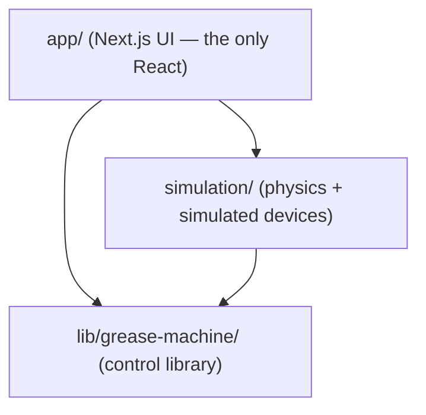

# Grease Machine


A temperature-compensated dispenser for thin drip oil. It calibrates against a scale, then dispenses precise pulses by running the motor for a computed time. The scale is only needed for calibration, not for normal operation.

The project is a TypeScript rewrite of an earlier Python prototype, organized as a detachable control library, a separate physics simulation, and a Next.js interface. The control library knows nothing about the simulation or the UI. It reaches hardware through three small interfaces (motor, scale, thermometer), so the same controller code runs against the simulation today and against real hardware later.

## Why pulses drift without compensation

Oil keeps flowing for a moment after the motor stops. That residual flow (the "drip") adds to every pulse. Both the flow rate and the drip change with temperature: warmer oil flows faster and drips less, colder oil flows slower and drips more. A dispenser that runs the motor for a fixed time therefore over-dispenses on warm days and under-dispenses on cold ones. This project measures that behavior during calibration and corrects for it at run time.

## Quick start

```bash
pnpm install
pnpm dev
```

Open http://localhost:3000.

## Documentation

This README is the overview. In-depth documentation lives in [`docs/`](docs/):

| Document | Covers |
|---|---|
| [Architecture](docs/architecture.md) | The layered one-way dependency and the detachable control library — the three hardware ports plus the clock port that form the hexagonal boundary. |
| [Control library](docs/control-library.md) | The library in depth: the calibration procedure and store, per-temperature model fitting, the drip-loading `(L, τ)` fit, the three interpolation strategies, the fixed-point pulse solver, and the manual/automatic controllers. |
| [Simulation](docs/simulation.md) | The physics ground-truth model, oil profiles, the simulated motor/scale/thermometer that implement the ports, the deterministic clock, and the scenario harness. |
| [Results](docs/results.md) | The exported `paper-data/` JSON and CSV datasets, how they are generated, and the headline interpolator-accuracy results. |

## Tech stack

The project is a `pnpm`-managed TypeScript codebase: a framework-free control library, a physics simulation, a Next.js web app, and a small TypeScript→Python data/figures pipeline.

| Area | Technologies |
|---|---|
| Language & package manager | TypeScript 5, Node.js, `pnpm` |
| Control library & simulation ([src/lib/](src/lib/), [src/simulation/](src/simulation/)) | Plain TypeScript with **no runtime dependencies** — no framework, network, or DOM. This is what makes the control library detachable and portable to real hardware. |
| Web app ([src/app/](src/app/)) | Next.js 16 (App Router) + React 19, Tailwind CSS 4, Radix UI primitives with shadcn-style components ([src/components/ui/](src/components/ui/)), Recharts for charts, `lucide-react` icons, `react-hook-form` + Zod for form inputs and validation |
| Data export scripts ([scripts/](scripts/)) | `vite-node` — runs the TypeScript exporter with the app's `@/` path alias resolved (see [vite.config.ts](vite.config.ts)); invoked via `pnpm script <name>` |
| Paper figures ([scripts/figures/](scripts/figures/)) | Python 3 + matplotlib + numpy (deps in [requirements.txt](scripts/figures/requirements.txt)); reads only the exported CSVs |
| Testing & QA | Vitest (unit tests plus an end-to-end simulation round-trip), ESLint (`eslint-config-next`), and `tsc --noEmit` type-checking |

The TypeScript and Python halves meet at a JSON/CSV handoff: the exporter writes `paper-data/`, and the standalone Python step plots figures from the CSVs — so the figure toolchain needs no TypeScript, and the app needs no Python.

## Scripts

- `pnpm dev` runs the development server.
- `pnpm build` creates a production build.
- `pnpm start` serves the production build.
- `pnpm test` runs the Vitest suite.
- `pnpm typecheck` runs `tsc --noEmit`.
- `pnpm lint` runs ESLint.
- `pnpm script:paper` regenerates the paper datasets and figures (the TypeScript exporter, then the Python figure step). See [Results](docs/results.md).

## How the control works

Units are grams, seconds, and degrees Celsius throughout.

### The control law

For a target pulse mass `m` at temperature `T`, the motor on-time is:

```
t = ( m - drip(T, t) ) / flow(T)
```

The drip depends on the pulse duration `t`, which is the value being solved for, so the controller solves the equation by fixed-point iteration. The iteration converges quickly because the drip changes slowly compared to the flow.

### Calibration

Calibration runs at one temperature at a time and records two pulses: a short one (5 g target) and a long one (30 g target). For each pulse the procedure runs the motor until the scale reaches the target mass, records the motor time, waits for the weight to settle (within 0.1 g over 15 seconds), and records the extra mass that dripped in. From the two pulses it derives the flow rate and two points on the drip-versus-duration curve.

At least two temperatures are required to operate. More temperatures reduce the interpolation error. Calibrating on the coldest and warmest expected days plus one in between works well.

### From two pulses to a drip model

The drip grows with pulse duration and levels off toward a temperature-dependent limit:

```
drip(t) = L * ( 1 - exp(-t / tau) )
```

The two calibration pulses give two points on this curve, which fix `L` and `tau`. Recovering the curve this way, rather than drawing a straight line between the two points, keeps short pulses accurate. The real curve bends, and a straight chord would miss it by several percent.

### Interpolation across temperature

Across temperature the controller interpolates the flow, `L`, and `tau` between calibration points. Three strategies are available (chosen from the header picker):

- **Arrhenius–Andrade** (the default) interpolates in log-space against inverse absolute temperature `1/T` in kelvin — the way real oil viscosity varies. It is the exact fit for the simulation's physics.
- **Geometric** interpolates in log-space against °C — a close approximation.
- **Linear** interpolates the raw values — a simple baseline that is biased between points because the real curves are exponential.

All three fit the same per-temperature model and share the same solver; only the interpolation differs. The small between-point residual each leaves is what the Accuracy and Compare tabs measure. See [Control library](docs/control-library.md) and [Results](docs/results.md) for the details and the accuracy comparison.

## The app

The interface has six tabs, plus a header picker for the oil profile and the interpolation strategy:

- **Operate**: pick the manual or automatic controller, set the ambient temperature, and run pulses. Manual mode holds the motor on while the button is pressed. Automatic mode dispenses a target mass on an interval.
- **Calibrate**: run calibrations at chosen temperatures and view the stored points.
- **Oil**: pick the oil profile (ISO VG 32 / 22 / 10) and view its kinematic-viscosity curve. Switching oil rebuilds the machine and clears calibration.
- **Curves**: flow and drip against temperature, from a standard multi-temperature calibration.
- **Accuracy**: dispensing error at 25 °C, a temperature between calibration points.
- **Compare**: the compensated controller against a fixed-time dispenser across a temperature sweep.

The chart tabs run their own simulation scenarios, so they work without any manual calibration.

## Architecture

Code flows in one direction. The app uses the simulation and the control library, the simulation uses the control library, and the control library depends on nothing internal.



```
src/
  lib/grease-machine/   control library (no React, no network)
    types.ts            namespace contracts (ports, calibration, controllers)
    math/               interp1d and the drip-loading fit
    calibration/        store and interpolators (the solver)
    controllers/        manual, automatic, and the registry
    procedures/         the calibration procedure
  simulation/           physics, simulated devices, clock, scenarios
  app/                  Next.js UI (the only place with React)
```

The control library reaches hardware through three interfaces in `types.ts`: `Hardware.Motor`, `Hardware.Scale`, and `Hardware.Thermometer`. The simulation implements them with a physics model. A real machine implements the same three with device drivers. See [Architecture](docs/architecture.md) for the full layering and the port contracts.

## Using real hardware

Implement the three port interfaces for your motor, scale, and thermometer, then build a controller with them:

```ts
import { createController, CalibrationStore } from "@/lib/grease-machine";

const devices = { motor, scale, thermometer }; // your implementations
const store = CalibrationStore.fromJSON(savedPoints);
const clock = {
  now: () => performance.now() / 1000,
  sleep: (s) => new Promise((r) => setTimeout(r, s * 1000)),
};

const auto = createController("automatic", { devices, store, clock });
await auto.dispense(5); // grams
```

Calibration, interpolation, and control stay the same. Only the device implementations change.

## Glossary

- **Flow** — the steady mass flow rate (g/s) while the motor runs; rises with temperature (warm oil is thinner).
- **Drip** — the residual mass (g) that keeps draining into the container after the motor stops. Modeled as the loading curve `drip(t) = L · (1 − exp(−t / τ))`.
- **Drip limit (`L`)** — the steady drip (g) a very long pulse approaches; falls with temperature.
- **Tau (`τ`)** — the drip loading time constant (s): how fast the residual charges toward `L`.
- **Calibration point** — one measurement at a single temperature and pulse regime (SHORT or LONG): temperature, calibration target mass, motor on-time, and observed drip.
- **Interpolator** — a strategy for interpolating the fitted model (`flow`, `L`, `τ`) between calibrated temperatures: Arrhenius–Andrade (default), geometric, or linear.
- **Compensated vs fixed-time** — the compensated (automatic) controller re-solves the on-time at the live temperature every pulse; a fixed-time dispenser is set once and drifts off-target as temperature changes.

## Tests

`pnpm test` covers the interpolation, the drip fit, the solver, the physics, and an end-to-end round trip that calibrates against the simulation, dispenses, and checks the delivered mass.
