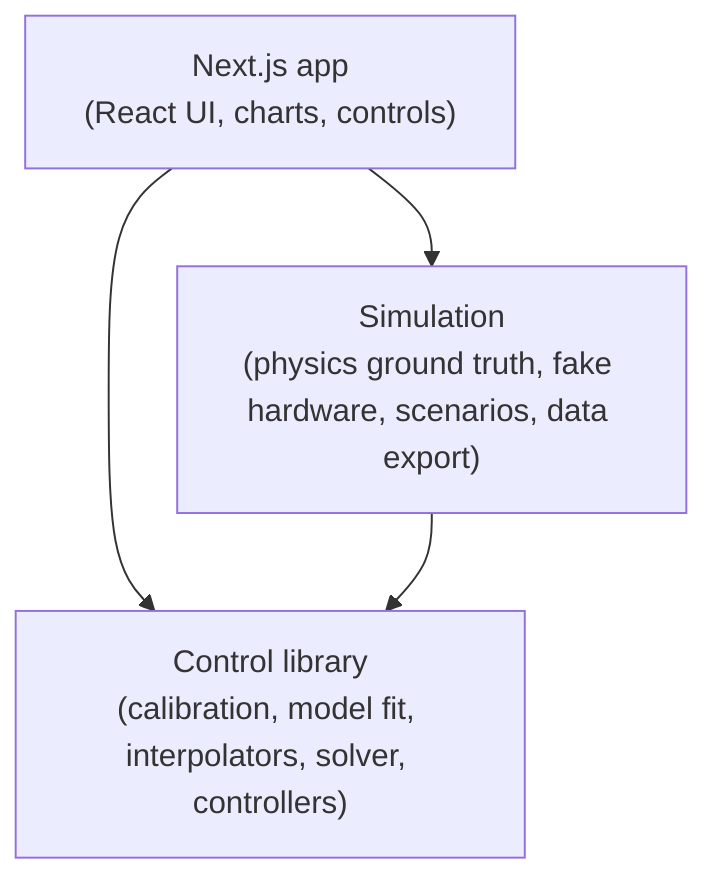

# Grease Machine

This is the documentation index for `grease-machine-ts`: a temperature-compensated, pulsed oil-dispensing controller, a physics simulation that stands in for real hardware, and a Next.js app that drives both. This page explains the problem the machine solves and the shape of the codebase, then links to the sibling documents that cover each part in depth. Units are grams (g), seconds (s), and degrees Celsius (°C) throughout; flow is in g/s.

## What the grease machine is

The job is to dispense a target mass of oil — say 2 g or 30 g — by running a pump motor for a computed on-time. The difficulty is that a pulse does not stop delivering the instant the motor stops. Oil in the tube keeps draining, leaving a residual **drip** in the container after the motor is off. That drip is not constant: it depends on temperature and on how long the pulse ran. Warm oil is thinner, so it flows faster while the motor runs and leaves a smaller, faster-settling drip; cold oil is thicker, so it flows slower and leaves a larger, slower-forming drip. A dispenser that always runs the motor for a fixed time is calibrated at exactly one temperature and drifts off-target as the oil warms or cools — over-dosing on one side, under-dosing on the other.

The machine compensates by modeling each temperature as two things: a steady mass **flow** (g/s) while the motor runs, and an exponential post-stop **drip** curve `drip(t) = L · (1 − exp(−t / τ))`, where `L` is the drip limit (g) a very long pulse approaches and `τ` is a loading time constant (s). It measures these during **calibration** — running short and long pulses at several temperatures and weighing what lands in the container — and fits `flow`, `L`, and `τ` at each calibrated temperature. At dispense time it reads the current temperature, interpolates the model across temperature, and solves for the motor on-time that will land the requested mass on target after drip is accounted for.

A key operating property follows from this: the **scale is needed only during calibration**. Once the model is fitted, dispensing is fully open-loop (feed-forward) — the controller reads temperature, computes an on-time, and runs the motor for exactly that long. No scale is required on the machine in operation, only a thermometer and a motor.

## The three layers in one glance

The codebase is three layers with a strict one-way dependency: the app depends on the simulation and, directly, on the control library; the simulation depends on the control library; and the control library depends on neither. There is no back-edge — the control library never imports the simulation or the UI.

- **Control library** (`../src/lib/grease-machine/`) — the detachable core. It has **no React and no network code**, and it never imports the simulation or the UI. Hardware lives behind three ports — `Motor`, `Scale`, `Thermometer` — plus a `Clock` port; the library talks only to those interfaces. This is the seam that lets the identical calibration, model-fitting, solver, and controller code run against the simulation today and real motor/scale/thermometer drivers later.
- **Simulation** (`../src/simulation/`) — implements the ports with a physics-driven "ground truth" model of flow and drip, a deterministic virtual clock, three oil profiles, comparison scenarios, and a paper-data exporter. The control library is unaware it is talking to a simulation.
- **Next.js app** (`../src/`) — the interactive front end that wires the simulation to controllers and renders live state and charts.

See [Architecture](./architecture.md) for the layered one-way design and the port contracts in detail.

## Documentation map

| Document | Covers |
|---|---|
| [Architecture](./architecture.md) | The layered one-way dependency and the detachable control library — the three hardware ports plus the clock port that form the hexagonal boundary. |
| [Control library](./control-library.md) | The library in depth: calibration procedure and store, per-temperature model fitting, the drip-loading `(L, τ)` fit, the three interpolation strategies, the fixed-point pulse solver, and the manual/automatic controllers. |
| [Simulation](./simulation.md) | The physics ground-truth model, oil profiles, the fake motor/scale/thermometer that implement the ports, the deterministic clock, and the scenario harness. |
| [Results](./results.md) | The exported `paper-data/` JSON and CSV datasets — physics curves, calibration points and fitted models, interpolated curves, accuracy, pulse runs, and compensated-vs-fixed comparisons — and how they are generated. |

## Running it

The project uses `pnpm`. From the repo root:

| Command | What it does |
|---|---|
| `pnpm install` | Install dependencies. |
| `pnpm dev` | Run the Next.js app in development. |
| `pnpm test` | Run the test suite (`vitest run`). |
| `pnpm typecheck` | Type-check with `tsc --noEmit`. |
| `pnpm lint` | Lint with ESLint. |
| `pnpm script:paper` | Regenerate the paper datasets and figures: run the exporter, then the Python figure step. |

`pnpm script:paper` runs `vite-node scripts/_run.ts export-paper-data && python3 scripts/figures/make_figures.py`. The exporter calibrates each oil once on an instant virtual clock and writes structured JSON to `paper-data/` plus tidy long-format CSV to `paper-data/csv/`; the Python step plots them into `paper-data/figures/`. The output is deterministic — byte-stable except for a single generated-at timestamp in the manifest. See [Results](./results.md) for the full dataset catalog and column definitions.

## Key concepts / glossary

- **Flow** — the steady mass flow rate (g/s) while the motor runs. Rises with temperature (warm oil is thinner). Recovered during calibration as `calTarget / motorOnTime`.
- **Drip** — the residual mass (g) that drains into the container *after* the motor stops. Modeled as the exponential loading curve `drip(t) = L · (1 − exp(−t / τ))` in the pulse duration `t` (s).
- **Drip limit (`L`)** — the steady-state drip (g) a very long pulse approaches as `t → ∞`. Falls with temperature.
- **Tau (`τ`)** — the drip loading time constant (s): how quickly the residual charges toward `L`. Smaller (faster) when warm.
- **Calibration point** — one raw measurement at a single temperature and pulse regime (`SHORT` or `LONG`): the temperature (°C), the calibration target mass `calTarget` (g), the `motorOnTime` (s, the pulse duration), and the observed `drip` (g). Two points at one temperature (short + long) uniquely fix that temperature's `flow`, `L`, and `τ`.
- **Interpolator** — a strategy for interpolating the fitted model quantities (`flow`, `L`, `τ`) *between* calibrated temperatures. Three are provided — Arrhenius (log against inverse absolute temperature `1/T`, the recommended default and exact for the simulator's viscosity physics), geometric (log against Celsius, a close approximation), and linear (baseline). All fit the same model and share the same solver; only the interpolation differs.
- **Compensated vs fixed-time** — a *fixed-time* dispenser runs the motor for a single on-time fixed at one calibration temperature and drifts off-target as temperature changes. The *compensated* (automatic) controller re-solves the on-time at the live temperature every pulse, holding the delivered mass near target across the operating band.

## See also

- [Architecture](./architecture.md)
- [Control library](./control-library.md)
- [Simulation](./simulation.md)
- [Results](./results.md)
