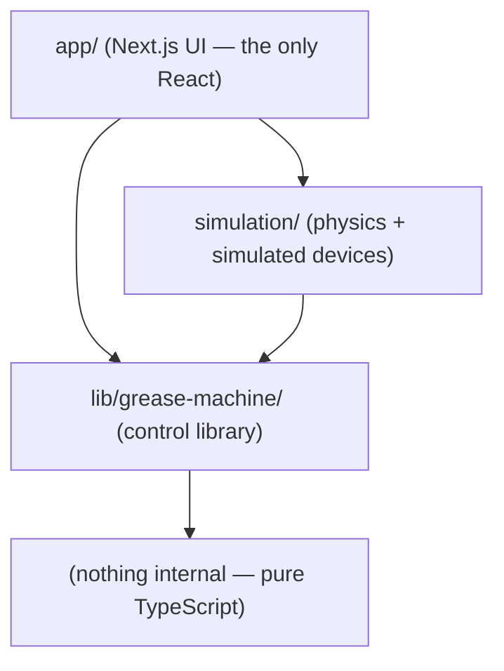
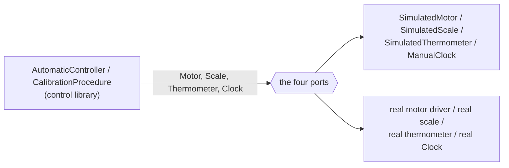

# Architecture

This document describes how `grease-machine-ts` is layered and, centrally, why the control library is a **detachable, standalone unit**. The whole design turns on one property: the control library — calibration, interpolation, the pulse solver, and the controllers — depends on nothing but a handful of narrow interfaces. It does not import the simulation, React, the network, or the DOM. The simulation implements those interfaces today; a real motor, scale, and thermometer implement the same interfaces later; the controller code in between never changes. Everything else in this document is a consequence of that single boundary. Units throughout are grams (g), seconds (s), and degrees Celsius (°C), with flow in g/s.

## 1. The layered, one-directional dependency graph

Dependencies point in exactly one direction: the app depends on the simulation, the simulation depends on the control library, and the control library depends on nothing internal. There is no back-edge. The control library never names the simulation or the UI; the simulation never names the UI.



The app depends on both layers below it: it constructs a `GreaseMachineSimulation` from the simulation layer and consumes types, controllers, and the interpolator registry from the control library directly. The simulation depends only on the control library. The control library is the sink of the graph — it imports no sibling `src/` code.

The two barrels state the rule in their own headers. The control-library barrel ([index.ts](../src/lib/grease-machine/index.ts)) opens with: "Framework-free and network-free … The simulation implements the ports; this library never imports the simulation or the UI." The simulation barrel ([index.ts](../src/simulation/index.ts)) mirrors it: "Imports the control library; the library never imports the simulation."

### The `src/` tree and each directory's role

| Path | Role |
|---|---|
| [src/lib/grease-machine/](../src/lib/grease-machine/) | The detachable control library. No React, no network, no DOM. |
| [types.ts](../src/lib/grease-machine/types.ts) | Namespace-as-contract: the hardware ports, the `Clock` port, calibration, interpolator, and controller contracts. |
| [consts.ts](../src/lib/grease-machine/consts.ts) | Numeric constants (calibration targets, solver tolerances, stability windows). |
| [errors.ts](../src/lib/grease-machine/errors.ts) | Domain error classes (`GreaseMachineError` and subclasses). |
| [math/](../src/lib/grease-machine/math/) | `interp1d` (piecewise-linear interpolation) and the drip-loading fit. |
| [calibration/](../src/lib/grease-machine/calibration/) | The `CalibrationStore` and the interpolator strategies (including the pulse solver). |
| [controllers/](../src/lib/grease-machine/controllers/) | The `ManualController`, `AutomaticController`, and their registry. |
| [procedures/](../src/lib/grease-machine/procedures/) | The calibration procedure. |
| [src/simulation/](../src/simulation/) | Physics-backed fakes that implement the ports, plus the composition root and scenarios. |
| [physics.ts](../src/simulation/physics.ts) | The ground-truth physics model the fake devices sample. |
| [oils.ts](../src/simulation/oils.ts) | The three oil profiles that parameterize the physics. |
| [clock.ts](../src/simulation/clock.ts) | `SystemClock` (real, optionally accelerated time) and `ManualClock` (instant, deterministic). |
| [hardware/](../src/simulation/hardware/) | `SimulatedMotor`, `SimulatedScale`, `SimulatedThermometer` — the port implementations. |
| [grease-machine-simulation.ts](../src/simulation/grease-machine-simulation.ts) | The composition root: wires devices + store + clock, hands out controllers and the procedure. |
| [scenarios/](../src/simulation/scenarios/) | Calibration, accuracy, and compare scenarios that drive the library end to end. |
| [src/app/](../src/app/) | The Next.js UI — the only place with React. |

## 2. The hexagonal boundary: three hardware ports plus a clock

The seam between the control library and the outside world is four interfaces declared in [types.ts](../src/lib/grease-machine/types.ts). These are the hexagonal ports: the control library is written entirely against them and never against a concrete device. Their header comment states the intent directly — "Hardware ports — implemented by the simulation today, real drivers later."

### The three hardware ports (`Hardware` namespace)

```ts
export namespace Hardware {
    export interface Motor {
        start(): void;        // energize the motor
        stop(): void;         // de-energize the motor
        isRunning(): boolean; // current motor state
    }

    export interface Scale {
        readWeight(): number; // current measured mass, in grams (g)
    }

    export interface Thermometer {
        readTemperature(): number; // current temperature, in °C
    }

    export interface Devices {
        motor: Motor;
        scale: Scale;
        thermometer: Thermometer;
    }
}
```

`Hardware.Devices` is the aggregate bundle `{ motor, scale, thermometer }` that controller factories receive. One design detail is worth surfacing here because it underlines the boundary: the `Scale` is used **only during calibration**, never during automatic operation. The automatic controller's dependency set omits the scale entirely (see [automatic-controller.ts](../src/lib/grease-machine/controllers/automatic-controller.ts)). After calibration, dispensing is fully open-loop (feed-forward), computed from the live temperature and the fitted calibration model. A machine in the field needs a scale only to be calibrated, not to run.

### The clock port

```ts
export interface Clock {
    now(): number;                          // monotonic time, in seconds (s)
    sleep(seconds: number): Promise<void>;  // resolve after N seconds (real wait, or instant in sim)
}
```

`Clock` is the second seam. It abstracts the passage of time so the exact same controller loop — `motor.start(); await clock.sleep(motorOnTime); motor.stop();` — runs in real time on hardware and *instantly* in the simulation. On hardware, `sleep` is a real wait (`setTimeout`); in the simulation's `ManualClock` it simply advances a virtual counter, so a pulse that "runs" for 150 s settles in microseconds of wall time. `now()` is monotonic seconds either way. This is what makes the timing-sensitive control code both physically faithful on a real machine and deterministic in tests.

### One code path, two implementations

Because controllers, the calibration procedure, and the solver touch **only** `Motor`, `Scale`, `Thermometer`, and `Clock` — plus the pure-math `Store` and `Interpolator` abstractions — the same code path serves both worlds:



The library ships the interface; the caller supplies the implementation. Substituting hardware for the simulation is a change of the objects passed in, not a change of any library code.

## 3. What independence buys

Detaching the control library from any particular device or framework is not an aesthetic choice; it buys three concrete properties.

**Testability.** Because the ports are trivially implementable, the entire dispense pipeline can be exercised against the physics simulation with no hardware and no wall-clock waiting. The end-to-end test does exactly this: it calibrates the controller against the simulated devices, dispenses a target mass, and asserts that the delivered mass matches — a full closed loop in milliseconds. The simulation's `ManualClock` makes those runs deterministic (identical inputs produce byte-stable outputs), so the tests and the exported paper data are reproducible rather than timing-dependent. The library's own unit tests (the interpolation, the drip fit, the solver) never touch a device at all.

**Portability to real hardware.** The port set is the entire contract a real machine must satisfy. To move from simulation to a physical dispenser you implement three small interfaces and a clock and pass them in; the calibration, interpolation, and control logic is unchanged. The README states this as the design goal: "It reaches hardware through three small interfaces (motor, scale, thermometer), so the same controller code runs against the simulation today and against real hardware later."

**No framework coupling.** The control library has no dependency on React, no network calls, and no DOM access — its barrel is explicit that it is "framework-free and network-free." It is plain TypeScript that could be published as a standalone package, embedded in a firmware build, or driven from a CLI. React lives exclusively in the app layer; persistence (localStorage, a file, an API) is the caller's concern via `CalibrationStore.toJSON` / `fromJSON`, so the library carries no I/O of its own.

## 4. Using real hardware

The recipe is the one from the [README](../README.md): implement the three port interfaces plus a `Clock`, restore calibration with `CalibrationStore.fromJSON`, build the automatic controller by key, and `await` a dispense. Nothing else in the library changes.

```ts
import { createController, CalibrationStore } from "@/lib/grease-machine";

const devices = { motor, scale, thermometer }; // your implementations
const store = CalibrationStore.fromJSON(savedPoints);
const clock = {
  now: () => performance.now() / 1000,
  sleep: (s) => new Promise((r) => setTimeout(r, s * 1000)),
};

const auto = createController("automatic", { devices, store, clock });
await auto.dispense(5); // grams
```

Here `motor`, `scale`, and `thermometer` are your driver objects satisfying `Hardware.Motor`, `Hardware.Scale`, and `Hardware.Thermometer`; `savedPoints` is a previously serialized `Calibration.StoreJson` (a flat array of calibration points). `createController("automatic", …)` returns a fully-typed `Controller.Automatic`, and `dispense(5)` runs one temperature-compensated pulse targeting 5 g: it reads the live temperature, solves the motor on-time against the calibration model, and drives `motor.start(); await clock.sleep(motorOnTime); motor.stop();`. As the README puts it: "Calibration, interpolation, and control stay the same. Only the device implementations change." The `Clock` shown is a real-time one; the simulation swaps in an instant clock, and nothing above it notices.

## 5. Dependency rules and how to keep them clean

The layering is enforceable by a single rule per layer, and the public surfaces are the barrels that make those layers substitutable.

### What may import what

- **Control library** ([src/lib/grease-machine/](../src/lib/grease-machine/)) may import: only itself and standard TypeScript. It must **not** import `src/simulation` or `src/app`, and must use no React, network, or DOM APIs. This is the invariant that makes it detachable; its barrel comment is the contract.
- **Simulation** ([src/simulation/](../src/simulation/)) may import: the control library (to implement its ports and orchestrate its controllers) and standard TypeScript. It must **not** import `src/app` or use React/DOM. It supplies the physics-backed fakes and the composition root.
- **App** ([src/app/](../src/app/)) may import: both layers below it. It is the only layer permitted React, and it is the top of the graph — nothing imports it.

### The public surfaces (barrels)

Each layer exposes exactly one entry point, so consumers depend on a stable surface rather than reaching into internals:

- The control library's barrel ([index.ts](../src/lib/grease-machine/index.ts)) re-exports the contracts (`types`), constants, errors, the interpolation and loading math, the `CalibrationStore`, the interpolator registry and factory, the controllers and their factory, and the calibration procedure. This is the whole detachable API — the four ports live in `types.ts`, and `createController` / `CalibrationStore` / `CalibrationProcedure` are the entry points a host wires together.
- The simulation's barrel ([index.ts](../src/simulation/index.ts)) re-exports the physics model, oil profiles, the two clocks, the simulated hardware, the `GreaseMachineSimulation` composition root, and the scenarios.

### The app layer on top

The app is a Next.js interface and the sole holder of React. It presents the machine across six tabs — Operate, Calibrate, Oil, Curves, Accuracy, and Compare (declared in [machine-view.tsx](../src/app/_components/machine-view.tsx)) — for driving the controllers, running calibration, choosing the oil profile and interpolation strategy, and viewing the curves and error charts. Crucially, the app is only a *host*: it constructs a `GreaseMachineSimulation`, reads snapshots, and calls the same library entry points a real machine would (`createController`, `dispense`, the calibration procedure). Because all of the domain logic lives below the React boundary, the UI is replaceable and the control library remains independent of it.

## See also

- [Control library](./control-library.md) — the grease-machine control library in depth.
- [Simulation](./simulation.md) — the physics simulation & test harness.
- [Results](./results.md) — the exported paper-data datasets & results.
- [README](./README.md) — index & system overview.
