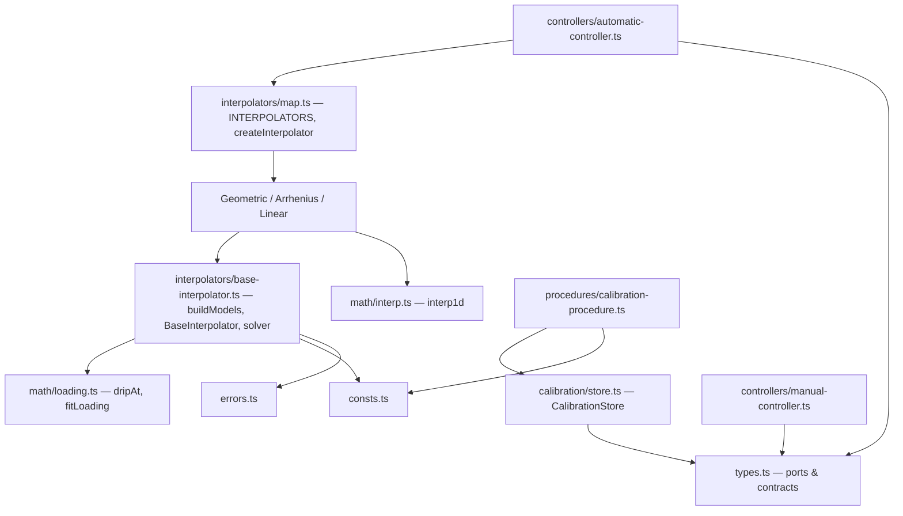

# The Grease-Machine Control Library

This document is a deep dive into `src/lib/grease-machine`, the framework-free, network-free control library that drives the drip-oil machine. It covers the module map, the control law that computes motor on-time from a mass target and temperature, the calibration procedure and store that produce the model's raw data, the two-pulse drip-loading fit, the temperature interpolation strategies (with their exact formulas and extrapolation behaviour), and the error and constant tables. Units are grams (g), seconds (s), and degrees Celsius (°C) throughout, with flow in grams per second (g/s); this convention is declared at the top of the contracts file ([types.ts](../src/lib/grease-machine/types.ts)) and is load-bearing everywhere.

## Overview and module map

The library is a self-contained control core. Its barrel ([index.ts](../src/lib/grease-machine/index.ts)) states the contract directly: it is "framework-free and network-free", exposing "hardware ports, calibration + interpolation math, controllers, and the calibration procedure", and it "never imports the simulation or the UI". The simulation implements the ports; the library is unaware it is talking to a simulation. This is a hexagonal (ports-and-adapters) boundary: the controllers depend only on interfaces, so the identical code runs against a simulation today and real motor/scale/thermometer drivers later.

The barrel re-exports the following surface ([index.ts](../src/lib/grease-machine/index.ts)):

| Export group | Source | Contents |
|---|---|---|
| `./types` | [types.ts](../src/lib/grease-machine/types.ts) | `Hardware.*`, `Clock`, `Calibration.*`, `Interpolator`, `Controller.*`, `DispenseResult`, and the `*_KEYS` / `PULSE_REGIMES` const tuples |
| `./consts` | [consts.ts](../src/lib/grease-machine/consts.ts) | all numeric constants (see the constants table) |
| `./errors` | [errors.ts](../src/lib/grease-machine/errors.ts) | `GreaseMachineError`, `InsufficientCalibrationError`, `TargetBelowDripError` |
| `./math/interp` | [interp.ts](../src/lib/grease-machine/math/interp.ts) | `interp1d` |
| `./math/loading` | [loading.ts](../src/lib/grease-machine/math/loading.ts) | `dripAt`, `fitLoading`, `LoadingFit` |
| `CalibrationStore` (named) | [store.ts](../src/lib/grease-machine/calibration/store.ts) | the in-memory calibration store |
| `./calibration/interpolators` | [interpolators/index.ts](../src/lib/grease-machine/calibration/interpolators/index.ts) | `BaseInterpolator`, `buildModels`, `GeometricInterpolator`, `ArrheniusInterpolator`, `LinearInterpolator`, `INTERPOLATORS`, `INTERPOLATOR_LIST`, `DEFAULT_INTERPOLATOR_KEY`, `createInterpolator` |
| `./controllers` | [controllers/index.ts](../src/lib/grease-machine/controllers/index.ts) | `ManualController`, `AutomaticController`, `CONTROLLERS`, `createController`, and the `*ControllerDeps` interfaces |
| `CalibrationProcedure` (named) | [calibration-procedure.ts](../src/lib/grease-machine/procedures/calibration-procedure.ts) | the calibration procedure and its `CalibrationProcedureDeps` type |

Note that `math/interp` and `math/loading` are re-exported at the top level even though they physically live under `src/lib/grease-machine/math/`.

The internal dependency direction is one-way: controllers and the procedure depend on the ports and the calibration/interpolation math; the interpolators depend on the math primitives and the store contract; the math primitives depend on nothing.



The domain contracts use the "namespace-as-contract" idiom ([types.ts](../src/lib/grease-machine/types.ts)): TypeScript `namespace`s group interfaces and types, and the only runtime code in the file is three `as const` tuples — `PULSE_REGIMES`, `INTERPOLATOR_KEYS`, and `CONTROLLER_KEYS`.

### The ports

The hardware ports are the hexagonal boundary ([types.ts](../src/lib/grease-machine/types.ts)):

```ts
Hardware.Motor       { start(): void; stop(): void; isRunning(): boolean }
Hardware.Scale       { readWeight(): number }        // grams
Hardware.Thermometer { readTemperature(): number }   // °C
Hardware.Devices     { motor: Motor; scale: Scale; thermometer: Thermometer }
```

`readWeight()` returns grams and is used ONLY during calibration; it is deliberately absent from the automatic controller's dependencies (see the control law below). The clock port ([types.ts](../src/lib/grease-machine/types.ts)) is the seam that lets the same code run in real time on hardware and instantly in simulation:

```ts
Clock { now(): number /* s, monotonic */; sleep(seconds: number): Promise<void> }
```

`now()` is monotonic time in seconds; `sleep(seconds)` resolves after that many seconds — a real wait on hardware, or instant in the simulation.

## The control law and the controllers

### The pulse equation

The heart of the machine is the equation that turns a requested mass into a motor on-time. At a temperature `T`, running the motor for `motorOnTime` seconds delivers `flow(T)·motorOnTime` grams while it runs, and then `drip(T, motorOnTime)` grams continue to drip out after it stops. To land exactly `massTarget` grams in the container, the motor-run mass must make up the difference between the target and the drip:

```
motorOnTime = (massTarget − drip(T, motorOnTime)) / flow(T)
```

This equation is documented in [base-interpolator.ts](../src/lib/grease-machine/calibration/interpolators/base-interpolator.ts). It is **implicit**: the drip term depends on the very `motorOnTime` we are solving for (a longer pulse charges more drip). It cannot be rearranged into a closed form because `drip` is an exponential of the unknown.

### Where the law lives

The pulse-equation solver is not in the controller. It lives in `BaseInterpolator.solveMotorTime` ([base-interpolator.ts](../src/lib/grease-machine/calibration/interpolators/base-interpolator.ts)), shared by every interpolation strategy. The automatic controller merely reads the temperature, builds an interpolator, and calls `solveMotorTime`. This keeps the physics in one place and lets the three interpolation strategies be an apples-to-apples comparison of the same solver (see the interpolation section).

The solver, verbatim ([base-interpolator.ts](../src/lib/grease-machine/calibration/interpolators/base-interpolator.ts)):

```ts
solveMotorTime(params) {
    const { massTarget, temperature } = params;
    const flow = this.flowRate(temperature);
    if (!Number.isFinite(flow) || flow <= 0) {
        throw new GreaseMachineError(
            `Non-physical flow (${flow} g/s) at ${temperature} °C — the calibration data looks corrupt.`,
        );
    }
    const { dripLimit, tauLoad } = this.dripParams(temperature);

    let t = massTarget / flow; // seed ignoring drip (an upper bound on the time)
    for (let i = 0; i < SOLVE_MAX_ITERATIONS; i++) {
        const drip = dripAt(t, dripLimit, tauLoad);
        const next = (massTarget - drip) / flow;
        if (next <= 0) {
            throw new TargetBelowDripError(massTarget, drip, temperature);
        }
        if (Math.abs(next - t) < SOLVE_TOLERANCE_S) return next;
        t = next;
    }
    if (!Number.isFinite(t) || t <= 0) {
        throw new GreaseMachineError(
            `Could not solve a finite motor time for ${massTarget} g at ${temperature} °C.`,
        );
    }
    return t;
}
```

Step by step:

1. **Flow at temperature.** `flow = this.flowRate(temperature)` (g/s), where `flowRate` interpolates the calibrated flows across temperature.
2. **Non-physical-flow guard.** If `flow` is non-finite or `≤ 0`, throw `GreaseMachineError`. A non-physical flow would make the motor time infinite and the dispense never stop, so it fails loudly instead of looping forever.
3. **Drip parameters.** `{ dripLimit, tauLoad }` are interpolated independently across temperature; see the drip model.
4. **Seed.** `t = massTarget / flow`. This ignores drip, so it is an upper bound on the true time: drip is non-negative and reduces the required motor-run mass, so the true time is always at or below this seed.
5. **Fixed-point iteration**, up to `SOLVE_MAX_ITERATIONS = 100`:
   - `drip = dripAt(t, dripLimit, tauLoad)` — the drip the current estimate would produce.
   - `next = (massTarget − drip) / flow` — the improved time.
   - **Achievability guard**: if `next ≤ 0`, the target sits at or below the drip floor and is unachievable — throw `TargetBelowDripError`.
   - **Convergence test**: if `|next − t| < SOLVE_TOLERANCE_S` (that is, `1e-7` s), return `next`.
   - Otherwise `t = next` and loop.
6. **Post-loop fallback.** If the loop exhausts its 100 iterations without converging and the last `t` is non-finite or `≤ 0`, throw `GreaseMachineError`; otherwise return the last `t`.

The iteration is the classic fixed point `t_{n+1} = Φ(t_n)` with `Φ(t) = (massTarget − drip(T, t)) / flow(T)`.

### Why it converges

The iteration map is `Φ(t) = (massTarget − drip(T, t)) / flow`. Its derivative is

```
Φ'(t) = −(1 / flow) · d(drip)/dt
```

and since `drip(t) = dripLimit · (1 − exp(−t / tauLoad))`,

```
d(drip)/dt = (dripLimit / tauLoad) · exp(−t / tauLoad)
Φ'(t)      = −(dripLimit / (flow · tauLoad)) · exp(−t / tauLoad)
```

Physically the drip loads slowly relative to the steady flow — `d(drip)/dt ≪ flow` — so `|Φ'(t)| ≪ 1` and `Φ` is a contraction. By the Banach fixed-point theorem the iterates converge geometrically to the unique fixed point, so a handful of iterations reach the `1e-7` s tolerance well within the 100-iteration cap. Because the seed `massTarget/flow` is an upper bound and each step subtracts a small, decreasing drip, the iterates approach the fixed point monotonically from above.

### The automatic controller

`AutomaticController` ([automatic-controller.ts](../src/lib/grease-machine/controllers/automatic-controller.ts)) is the compensated pulsed dispenser. Its dependencies are:

```ts
AutomaticControllerDeps {
    motor: Hardware.Motor;
    thermometer: Hardware.Thermometer;
    store: Calibration.Store;
    clock: Clock;
    interpolatorKey?: Interpolator.Key;  // defaults to arrhenius
}
```

There is deliberately **no `Scale`**. After calibration, dispensing is fully open-loop (feed-forward): the on-time is computed from temperature and the calibration model, and the scale is never read during operation. This is the central operating principle of the machine.

`dispense(massTarget)` is the per-pulse algorithm:

```ts
async dispense(massTarget) {
    const { motor, thermometer, store, clock, interpolatorKey } = this.deps;
    const temperature = thermometer.readTemperature();
    const interpolator = createInterpolator(
        interpolatorKey ?? DEFAULT_INTERPOLATOR_KEY, store,
    );
    const motorOnTime = interpolator.solveMotorTime({ massTarget, temperature });
    const estimatedDrip = interpolator.drip(temperature, motorOnTime);
    motor.start();
    await clock.sleep(motorOnTime);
    motor.stop();
    return { massTarget, temperature, motorOnTime, estimatedDrip };
}
```

1. Read the temperature (°C) from the thermometer port.
2. Build a fresh interpolator via `createInterpolator(interpolatorKey ?? DEFAULT_INTERPOLATOR_KEY, store)` — the default key is `"arrhenius"`. A fresh interpolator is built per call, which re-fits the models from the store, so any calibration point added since the last dispense takes effect immediately with no controller re-wiring.
3. Solve the on-time: `motorOnTime = interpolator.solveMotorTime({ massTarget, temperature })`.
4. Compute `estimatedDrip = interpolator.drip(temperature, motorOnTime)`. This is a model prediction, not a measurement — the scale is unused at runtime.
5. Run the motor for exactly the solved time: `motor.start(); await clock.sleep(motorOnTime); motor.stop()`. Timing precision is delegated to `Clock.sleep`, so the same code runs instantly in the simulation and in real time on hardware.
6. Return a `DispenseResult` of `{ massTarget, temperature, motorOnTime, estimatedDrip }`. The `DispenseResult` shape is in [types.ts](../src/lib/grease-machine/types.ts).

`runPulsed(params)` repeats the cycle. It destructures `{ massPerPulse, intervalSeconds, pulses, onPulse, shouldStop }` (params shape in [types.ts](../src/lib/grease-machine/types.ts)) and loops:

```ts
let count = 0;
while (!shouldStop?.() && (pulses === undefined || count < pulses)) {
    const result = await this.dispense(massPerPulse);
    onPulse?.(result);
    count += 1;
    if (shouldStop?.() || (pulses !== undefined && count >= pulses)) break;
    await this.deps.clock.sleep(intervalSeconds);
}
```

The loop runs open-ended when `pulses` is `undefined`. The double-check before sleeping is deliberate: it avoids waiting `intervalSeconds` after the final pulse and lets `shouldStop` cancel promptly. So `intervalSeconds` is strictly an inter-pulse wait, never a trailing delay.

### The manual controller

`ManualController` ([manual-controller.ts](../src/lib/grease-machine/controllers/manual-controller.ts)) is direct, hold-to-run motor control used to fill hoses before calibration, purge air, and dispense ad-hoc. Its dependency set is only the motor — no calibration, scale, or thermometer:

```ts
ManualControllerDeps { motor: Hardware.Motor }
```

Its methods forward to the motor port:

- `motorOn(): void` → `motor.start()` (press and hold).
- `motorOff(): void` → `motor.stop()` (release).
- `isRunning(): boolean` → `motor.isRunning()`.

### The controller registry

`CONTROLLERS` ([map.ts](../src/lib/grease-machine/controllers/map.ts)) is a key-to-factory table typed as `{ [K in Controller.Key]: ControllerRegistry.Entry<K> }`. The UI iterates it to build a selector; the composition root calls the chosen factory with the devices it has. There is no per-controller special-casing — adding a controller is adding one entry. The entries:

- `manual` — label `"Manual"`; `create: ({ devices }) => new ManualController({ motor: devices.motor })`, pulling only the motor out of `Devices`.
- `automatic` — label `"Automatic (compensated)"`; `create: ({ devices, store, clock, interpolatorKey }) => new AutomaticController({ motor, thermometer, store, clock, interpolatorKey })`, wiring the full port set.

`createController<K>(key, deps): Controller<K>` ([map.ts](../src/lib/grease-machine/controllers/map.ts)) returns `CONTROLLERS[key].create(deps) as Controller<K>`. The generic parameter `K` preserves the precise controller type per key (via the `Controller.Map` alias in [types.ts](../src/lib/grease-machine/types.ts)), so `createController("manual", …)` is typed as `Controller.Manual` and `createController("automatic", …)` as `Controller.Automatic`.

## Calibration

The control law needs two per-temperature quantities: a steady flow (g/s) and an exponential drip-loading curve. Calibration produces the raw measurements those are fitted from. The library separates responsibilities cleanly: the `CalibrationProcedure` records raw measurements only; the fit into `(flow, dripLimit, tauLoad)` happens later in `buildModels` (see the drip-model section).

### The calibration procedure

`CalibrationProcedure` ([calibration-procedure.ts](../src/lib/grease-machine/procedures/calibration-procedure.ts)) has dependencies `{ devices, store, clock }`. Its `run(regime)` method executes ONE calibration point at the current temperature for ONE pulse regime; a complete temperature (both regimes) requires two `run` calls. The two regimes are `PULSE_REGIMES = ["SHORT", "LONG"]` ([types.ts](../src/lib/grease-machine/types.ts)), whose target masses are `TARGET_SHORT_G = 5` g and `TARGET_LONG_G = 30` g, keyed by `CALIBRATION_TARGETS` ([consts.ts](../src/lib/grease-machine/consts.ts)).

The precondition is that the hoses are pre-filled, so the baseline is a true steady state and the measured drip reflects only post-pulse loading, not initial hose charging.

`run(regime)` ([calibration-procedure.ts](../src/lib/grease-machine/procedures/calibration-procedure.ts)):

```ts
async run(regime) {
    const { motor, scale, thermometer } = devices;
    const calTarget = CALIBRATION_TARGETS[regime];          // 5 g or 30 g
    const temperature = thermometer.readTemperature();      // °C
    const baseline = scale.readWeight();                    // g, pre-pulse
    motor.start();
    const start = clock.now();
    while (scale.readWeight() - baseline < calTarget) {
        await clock.sleep(POLL_S);                          // 0.001 s
    }
    motor.stop();
    const motorOnTime = clock.now() - start;                // s
    const finalWeight = await this.waitForStabilization();  // g
    const drip = finalWeight - baseline - calTarget;        // g
    const point = { temperature, regime, calTarget, motorOnTime, drip };
    store.addPoint(point);
    return point;
}
```

1. **Resolve the target.** `calTarget = CALIBRATION_TARGETS[regime]` — 5 g for SHORT, 30 g for LONG.
2. **Snapshot inputs.** Read `temperature` (°C) and `baseline`, the pre-pulse scale reading.
3. **Start and timestamp.** `motor.start(); start = clock.now()`.
4. **Delivery loop.** Busy-poll the scale every `POLL_S = 0.001` s until the net delivered mass `readWeight − baseline` reaches `calTarget`. Because it checks before sleeping and stops the moment the threshold is crossed, it overshoots by at most one poll's worth of flow (`flow × POLL_S`), which the constant's own comment argues stays well under `STABLE_TOLERANCE_G`.
5. **Stop and measure pulse duration.** `motor.stop(); motorOnTime = clock.now() − start`. This `motorOnTime` is both the flow denominator later (`flow = calTarget / motorOnTime`) and the pulse-duration x-anchor for the drip curve.
6. **Settle wait.** `finalWeight = await this.waitForStabilization()`; see below.
7. **Compute drip.** `drip = finalWeight − baseline − calTarget`. `finalWeight − baseline` is the total mass added over the whole event; subtracting `calTarget` isolates the post-stop residual, which is exactly the drip. Pre-filled hoses make this residual purely the loading drip.
8. **Build, store, return.** Assemble the `Calibration.Point`, `store.addPoint(point)`, and return it.

### The settle criterion

`waitForStabilization()` ([calibration-procedure.ts](../src/lib/grease-machine/procedures/calibration-procedure.ts)) returns the settled scale reading (g). It is a sliding-reference stability detector:

```ts
let reference = scale.readWeight();
let stableSince = clock.now();
const deadline = clock.now() + STABILIZATION_TIMEOUT_S;       // + 120 s
while (clock.now() < deadline) {
    await clock.sleep(POLL_S);                                // 0.001 s
    const current = scale.readWeight();
    if (Math.abs(current - reference) > STABLE_TOLERANCE_G) { // moved > 0.1 g
        reference = current;                                 // re-anchor
        stableSince = clock.now();                           // reset the window
    } else if (clock.now() - stableSince >= STABLE_WINDOW_S) { // held ≥ 15 s
        return current;
    }
}
return scale.readWeight();                                    // timeout fallback
```

The criterion is: the reading is "stable" once it has stayed within `±STABLE_TOLERANCE_G` (0.1 g) of a moving `reference` for a continuous `STABLE_WINDOW_S` (15 s). Any poll that deviates from the reference by more than 0.1 g is treated as still-dripping — it re-anchors `reference` to the new reading and resets `stableSince`, so the 15 s window only elapses once the drip has genuinely quieted below 0.1 g of drift. The tolerance is measured against the drifting reference, not the original baseline, which lets it track slow monotonic creep: each 0.1 g step re-anchors, so the window only completes when the drip rate falls low enough that no further 0.1 g step occurs within 15 s. A safety deadline of `STABILIZATION_TIMEOUT_S` (120 s) caps the wait; on timeout it returns the current reading rather than throwing, so a never-settling drip yields a (possibly slightly-early) number instead of hanging. That number propagates into `drip`.

### From measurement to raw model quantities

Because the scale reads the machine's true physics back out through the port, calibration recovers the ground truth with only tiny discretization noise from the `POLL_S` overshoot:

- `flow = calTarget / motorOnTime` (g/s) — grams delivered divided by seconds running gives the steady mass flow.
- `drip` (g) — the residual after the motor stopped, the y-anchor of the drip-loading curve at that pulse duration.

The SHORT and LONG points at one temperature thus give two `(motorOnTime, drip)` anchors on the drip curve and two independent flow estimates.

### The calibration store

`CalibrationStore` ([store.ts](../src/lib/grease-machine/calibration/store.ts)) is the in-memory implementation of the `Calibration.Store` contract ([types.ts](../src/lib/grease-machine/types.ts)). Its central design decision is to keep points sorted by temperature (then regime), which maintains the ascending-temperature invariant the interpolators rely on; persistence to localStorage, a file, or an API is the caller's concern via `toJSON` / `fromJSON`, keeping the library portable.

The stored unit is `Calibration.Point` ([types.ts](../src/lib/grease-machine/types.ts)):

| Field | Unit | Meaning |
|---|---|---|
| `temperature` | °C | temperature at calibration time |
| `regime` | — | `"SHORT"` or `"LONG"` |
| `calTarget` | g | mass delivered while the motor ran |
| `motorOnTime` | s | motor on-time to reach `calTarget` (the pulse duration) |
| `drip` | g | residual mass that dripped after the motor stopped |

The members ([store.ts](../src/lib/grease-machine/calibration/store.ts)):

- `get points(): readonly Point[]` — the sorted backing array, read-only.
- `addPoint(point)` — pushes a shallow copy `{ ...point }` (copy-on-insert prevents external mutation from leaking in), then re-sorts by `a.temperature - b.temperature || a.regime.localeCompare(b.regime)`. Because `localeCompare` is alphabetical, `"LONG"` sorts before `"SHORT"` at equal temperature.
- `clear()` — resets to `[]`.
- `completeTemperatures(): number[]` — builds a `Map<temperature, Set<Regime>>` and keeps the temperatures whose set contains both regimes (`PULSE_REGIMES.every(r => regimes.has(r))`), returned sorted ascending. "Complete" means the temperature has both a SHORT and a LONG point.
- `isReady(): boolean` — `completeTemperatures().length >= 2`. Two is the minimum because the interpolator needs at least two model points to interpolate over temperature.
- `toJSON(): StoreJson` — maps to a flat array of point copies (`StoreJson = Point[]`, [types.ts](../src/lib/grease-machine/types.ts)). Points come out temperature-sorted because the array is kept sorted.
- `static fromJSON(json): CalibrationStore` — constructs a fresh store and `addPoint`s each entry, so the result is re-sorted and re-normalized regardless of input order.

The procedure only ever touches `store.addPoint`.

## From two pulses to a drip model

### The drip-loading model

As a pulse runs, the fluid column charges and the residual drip approaches a temperature-dependent limit. The library models that loading as an exponential saturation ([loading.ts](../src/lib/grease-machine/math/loading.ts)):

```
drip(t) = dripLimit · (1 − exp(−t / tauLoad))
```

with `t` the pulse duration (s), `dripLimit` (a.k.a. `L`) the steady-state drip as the pulse grows long (g), and `tauLoad` (a.k.a. `τ`) the loading time constant (s). The curve is 0 at `t = 0`, rises with diminishing returns, and asymptotes to `L` as `t → ∞`. It is concave — that concavity is the whole reason for recovering the curve rather than chord-interpolating (below).

`dripAt(pulseDuration, dripLimit, tauLoad)` ([loading.ts](../src/lib/grease-machine/math/loading.ts)) evaluates the model, with two edge guards:

```ts
if (tauLoad <= 0) return dripLimit;      // degenerate: treat as instantly saturated
if (pulseDuration <= 0) return 0;
return dripLimit * (1 - Math.exp(-pulseDuration / tauLoad));
```

The fit result type is `LoadingFit { dripLimit: number; tauLoad: number }` ([loading.ts](../src/lib/grease-machine/math/loading.ts)).

### Recovering L and τ from two anchors

`fitLoading(pulseA, dripA, pulseB, dripB): LoadingFit` ([loading.ts](../src/lib/grease-machine/math/loading.ts)) is the "recover L and τ" step. Two calibration durations at one temperature give two `(pulseDuration, drip)` anchors, which uniquely fix the two parameters of the exponential.

The algorithm:

1. **Order** so `t1 < t2` (swap both `(t, d)` pairs if needed).
2. **Degenerate/non-concave guard.** If `t1 <= 0 || t2 <= t1 || d1 <= 0 || d2 <= d1` → `linearFallback()`.
3. **Concavity test.** Let `ratio = d2/d1` (`> 1`) and `k = t2/t1` (`> 1`). A genuinely concave loading curve requires drip to grow slower than duration, i.e. `ratio < k`. If `ratio >= k` the data is linear or convex, so the concave model does not apply → `linearFallback()`.
4. **Root-find for `a = exp(−t1/τ) ∈ (0, 1)`.** From the two model equations `d1 = L(1 − a)` and `d2 = L(1 − a^k)` (since `t2 = k·t1` gives `exp(−t2/τ) = a^k`), dividing to eliminate `L` yields

   ```
   g(a) = (1 − a^k) / (1 − a) = ratio
   ```

   `g` increases monotonically from `1` (as `a → 0`) to `k` (as `a → 1`), so a unique root exists for `1 < ratio < k`. It is solved by bisection on `[lo, hi] = [1e-12, 1 − 1e-12]`, 200 iterations, narrowing by comparing `g(mid)` to `ratio`. Each iteration halves the bracket, so after 200 halvings the width is far below machine precision — deliberate over-kill, and safe because `g` is monotone so there is no ambiguity.
5. **Recover the parameters:**

   ```
   a         = 0.5 · (lo + hi)
   tauLoad   = −t1 / Math.log(a)      // since a = exp(−t1/τ)
   dripLimit = d1 / (1 − a)           // since d1 = L·(1 − a)
   ```

   Because `a ∈ (0, 1)`, `log(a) < 0`, so `tauLoad > 0`.

`linearFallback()` ([loading.ts](../src/lib/grease-machine/math/loading.ts)) handles noisy, degenerate, or non-concave data. It sets `tau = 1e6` — a very large τ, so `drip(t)` is near-linear in `t` over the operating range — and back-solves `dripLimit = d2 / (1 − exp(−t2/tau))`, anchoring the near-linear curve at the longer pulse `(t2, d2)`. This yields a usable, monotone, non-crashing curve even when the model does not strictly apply.

### Why recover the curve instead of a straight chord

Recovering the exponential's `(L, τ)`, rather than drawing a straight chord between the two anchors, is what keeps short-pulse dispensing precise ([loading.ts](../src/lib/grease-machine/math/loading.ts)). The loading curve is concave, so a linear chord across it mis-estimates drip by several percent for pulse durations between and below the anchors — precisely the short-pulse regime where a few grams' target makes a percent-level drip error significant. Two anchors uniquely determine the exponential and reproduce both anchors exactly, so the interpolation between them is correct rather than biased.

### Fitting per-temperature models

`buildModels(store): Calibration.TemperatureModel[]` ([base-interpolator.ts](../src/lib/grease-machine/calibration/interpolators/base-interpolator.ts)) is strategy-independent; every interpolator shares it. It groups `store.points` by temperature into a `Map<temperature, Partial<Record<Regime, Point>>>` and, for each temperature that has BOTH regimes (skipping incomplete ones):

- **Flow** (g/s), the average of the two regimes' independent estimates:

  ```
  flowShort = short.calTarget / short.motorOnTime
  flowLong  = long.calTarget  / long.motorOnTime
  flow      = (flowShort + flowLong) / 2
  ```

  This uses `calTarget` (motor-on mass), not total mass, because drip is modeled separately. Averaging assumes flow is regime-independent (a single steady rate), with the regime-dependent residual captured entirely by the drip curve.

- **Drip curve**: `fitLoading(short.motorOnTime, short.drip, long.motorOnTime, long.drip)` → `{ dripLimit, tauLoad }`. Note the drip curve's x-axis is `motorOnTime` (pulse duration in seconds), not `calTarget`.

Each temperature yields a `Calibration.TemperatureModel { temperature, flow, dripLimit, tauLoad }` ([types.ts](../src/lib/grease-machine/types.ts)), and the models are returned sorted ascending by temperature, re-establishing the invariant the sample arrays need.

## Interpolation across temperature

Calibration produces a model at each calibrated temperature. To dispense at an arbitrary temperature, the library interpolates `flow`, `dripLimit`, and `tauLoad` — each independently — across temperature. The single design principle ([types.ts](../src/lib/grease-machine/types.ts), [base-interpolator.ts](../src/lib/grease-machine/calibration/interpolators/base-interpolator.ts)): every strategy fits the SAME per-temperature model and solves the SAME pulse equation; they differ ONLY in how they interpolate that model between calibrated temperatures. This makes the strategies an apples-to-apples comparison and isolates the interpolation choice to one overridable method.

### The `BaseInterpolator` seam

`BaseInterpolator` ([base-interpolator.ts](../src/lib/grease-machine/calibration/interpolators/base-interpolator.ts)) is the shared core. Its constructor runs `buildModels(store)`, throws `InsufficientCalibrationError(models.length)` if there are fewer than two models, and then stores four parallel arrays aligned by index: `temps` (°C), `flows` (g/s), `dripLimits` (g), `tauLoads` (s).

The only abstract method — the single strategy seam — is `protected abstract interp(temperature, values): number`: interpolate ONE model quantity at a temperature, where `values` are the calibrated samples aligned with `temps`. Subclasses implement only this.

Everything else is concrete and identical across strategies:

- `flowRate(temperature) = this.interp(temperature, this.flows)`, g/s.
- private `dripParams(temperature) = { dripLimit: interp(T, dripLimits), tauLoad: interp(T, tauLoads) }` — L and τ are each interpolated independently over temperature, using the same strategy.
- `drip(temperature, pulseDuration)` — reads the interpolated `{ dripLimit, tauLoad }` and returns `dripAt(pulseDuration, dripLimit, tauLoad)`, g.
- `solveMotorTime(...)` — the fixed-point solver described in the control-law section.

### The `interp1d` primitive

All three strategies delegate their actual number-crunching to `interp1d` ([interp.ts](../src/lib/grease-machine/math/interp.ts)), a 1-D piecewise-linear interpolator that matches `numpy.interp` exactly inside `[xs[0], xs[n-1]]`. Its contract requires `xs` ascending and `xs.length === ys.length`:

```ts
interp1d(
  x: number,
  xs: readonly number[],
  ys: readonly number[],
  { extrapolate = false }: { extrapolate?: boolean } = {},
): number
```

Guards: it throws `"interp1d: empty sample arrays"` if `n === 0` and `"interp1d: xs and ys length mismatch"` if the lengths differ.

Interior interpolation: a linear scan finds the bracket `[xs[lo], xs[hi]]` with `xs[lo] <= x < xs[hi]`, then

```
t = (x − x0) / (x1 − x0)
return ys[lo] + t · (ys[hi] − ys[lo])
```

with a degenerate-interval guard returning `ys[lo]` when `x1 === x0`. The scan is O(n) per call, which is fine for the handful of calibration temperatures.

The tail behaviour is selectable:

- **`extrapolate: false` (default, `numpy.interp` semantics):** clamp to the nearest endpoint. `x <= xs[0]` returns `ys[0]`; `x >= xs[n-1]` returns `ys[n-1]`. The boundary value is held flat outside the range.
- **`extrapolate: true`:** continue the nearest boundary SEGMENT's slope, so the line extends tangent to the curve — value AND slope match at the seam, giving a C1-continuous tail with no kink. Below range (needs `n >= 2`):

  ```
  ys[0] + ((x − xs[0]) · (ys[1] − ys[0])) / (xs[1] − xs[0])
  ```

  Above range (needs `n >= 2`):

  ```
  ys[n-1] + ((x − xs[n-1]) · (ys[n-1] − ys[n-2])) / (xs[n-1] − xs[n-2])
  ```

  With a single sample there is no slope to extend, so it clamps regardless (the `n < 2` guards).

All three strategies pass `extrapolate: true`, so dispensing outside the calibrated temperature band degrades smoothly along the tangent tail rather than freezing flow and drip at the last calibrated value.

### The three strategies

Each strategy overrides only `interp`. They differ in the space in which they run the piecewise-linear interpolation.

#### Arrhenius-Andrade (log versus 1/T in kelvin) — the default and recommended strategy

`ArrheniusInterpolator` ([arrhenius-interpolator.ts](../src/lib/grease-machine/calibration/interpolators/arrhenius-interpolator.ts)), key `"arrhenius"`, with `KELVIN = 273.15` (0 °C in kelvin). It interpolates the logarithm of each quantity linearly against inverse absolute temperature `1/(T + 273.15)`, then exponentiates:

```
invKelvin = this.temps.map(c => 1 / (c + KELVIN)).reverse()
logs      = values.map(v => Math.log(v)).reverse()
interp(T, values) = Math.exp(
    interp1d(1 / (T + KELVIN), invKelvin, logs, { extrapolate: true })
)
```

This is the textbook Arrhenius-Andrade viscosity law `ln(μ) = A + B/T`; since flow ≈ 1/μ, `ln(flow)` is linear in `1/T`. It is the physically-canonical fit for real oils over a wide temperature span ([arrhenius-interpolator.ts](../src/lib/grease-machine/calibration/interpolators/arrhenius-interpolator.ts)). The `.reverse()` on both arrays is a correctness detail: `1/(T_°C + 273.15)` decreases as Celsius rises, so the ascending-°C `temps` map to a descending `1/T`; reversing both `invKelvin` and `logs` restores the ascending `xs` that `interp1d` requires while keeping x and y aligned. Extrapolating the end slope in `(1/T, ln·)` space gives a physical Arrhenius tail outside the band.

Because the simulation's ground-truth physics follows exactly this law — every quantity is exp of a linear function of `1/T` (see [simulation.md](./simulation.md)) — `ln(value)` is exactly linear in `1/T`, and this strategy reconstructs the model *exactly* between calibration points, limited only by calibration discretization. That makes it the most accurate strategy here (about 0.001 % mean error in [the results](./results.md)) and the recommended default. On data shaped differently the ranking would shift — a pure exponential in Celsius, for instance, would make geometric the exact one — so which interpolator is "best" tracks the physics of the actual data.

#### Geometric (log-space) — a close approximation

`GeometricInterpolator` ([geometric-interpolator.ts](../src/lib/grease-machine/calibration/interpolators/geometric-interpolator.ts)), key `"geometric"`, interpolates the logarithm of each quantity linearly over temperature (in °C), then exponentiates:

```
interp(T, values) = Math.exp(
    interp1d(T, this.temps, values.map(Math.log), { extrapolate: true })
)
```

Flow, the drip limit, and τ all vary roughly exponentially with temperature, so a straight line over the raw values overshoots on the convex side and leaves a percent-level bias between calibration points; interpolating in log-space removes almost all of it ([geometric-interpolator.ts](../src/lib/grease-machine/calibration/interpolators/geometric-interpolator.ts)). This is *exact* for a pure exponential in Celsius — `log` linearizes it, linear interpolation is exact on a line, and `exp` inverts. But the simulator's true physics is exponential in `1/T` (Arrhenius), not in Celsius, so geometric is a close *approximation* here: a small residual between calibration points (about 0.07–0.09 % mean error in [the results](./results.md)), tighter than linear but a hair behind Arrhenius. Outside the band, extending the end slope in log-space gives a smooth exponential tail tangent to the curve: constant multiplicative rate per °C, never flat, never negative. (The quantities are assumed strictly positive so `Math.log` is finite.)

#### Linear — the baseline

`LinearInterpolator` ([linear-interpolator.ts](../src/lib/grease-machine/calibration/interpolators/linear-interpolator.ts)), key `"linear"`, interpolates each quantity itself linearly over temperature:

```
interp(T, values) = interp1d(T, this.temps, values, { extrapolate: true })
```

It is exact at calibrated points but carries a small, systematic bias between them because the real curves are exponential ([linear-interpolator.ts](../src/lib/grease-machine/calibration/interpolators/linear-interpolator.ts)). Outside the band the tail is a straight line extending the end chord's slope.

#### Extrapolation tails compared

| Strategy | Interpolation space | Tail outside the band (`extrapolate: true`) |
|---|---|---|
| linear | value vs °C | straight line, slope = last chord (can go negative if extended far) |
| geometric | ln(value) vs °C | exponential, tangent in log-space (stays positive) |
| arrhenius | ln(value) vs 1/T (kelvin) | Arrhenius, tangent in (1/T, ln) space (stays positive) |

All three tails are C1 at the seam (value and slope continuous), and all three rules apply identically to `flow`, `dripLimit`, and `tauLoad`.

### The interpolator registry

`INTERPOLATOR_KEYS = ["arrhenius", "geometric", "linear"]` ([types.ts](../src/lib/grease-machine/types.ts)) enumerates the strategies. `DEFAULT_INTERPOLATOR_KEY = "arrhenius"` ([map.ts](../src/lib/grease-machine/calibration/interpolators/map.ts)) is the recommended default.

`INTERPOLATORS` ([map.ts](../src/lib/grease-machine/calibration/interpolators/map.ts)) is a fully-typed record `{ [K in Interpolator.Key]: InterpolatorRegistry.Entry }`. Each entry ([types.ts](../src/lib/grease-machine/types.ts)) carries `key`, `label` (an English fallback; the UI prefers the i18n name), `description`, an optional `recommended` flag, and `create(store): Interpolator`:

| Key | Label | `recommended` | Factory |
|---|---|---|---|
| `arrhenius` | `Arrhenius-Andrade (1/T)` | `true` | `store => new ArrheniusInterpolator(store)` |
| `geometric` | `Geometric (log-space)` | — | `store => new GeometricInterpolator(store)` |
| `linear` | `Linear` | — | `store => new LinearInterpolator(store)` |

`INTERPOLATOR_LIST = INTERPOLATOR_KEYS.map(k => INTERPOLATORS[k])` ([map.ts](../src/lib/grease-machine/calibration/interpolators/map.ts)) gives the entries in declared order, for selectors and comparison charts. `createInterpolator(key, store): Interpolator` ([map.ts](../src/lib/grease-machine/calibration/interpolators/map.ts)) returns `INTERPOLATORS[key].create(store)` — the factory-by-key used by the automatic controller and by the paper-data export. As with controllers, adding a strategy is adding one registry entry plus its key to `INTERPOLATOR_KEYS`; there is no special-casing.

## Errors and constants

### Errors

The error hierarchy lives in [errors.ts](../src/lib/grease-machine/errors.ts):

| Error | Constructor | Message | Thrown where |
|---|---|---|---|
| `GreaseMachineError` | (extends `Error`) | — | base for all domain errors; also raised inline for non-physical flow and non-finite solve in `BaseInterpolator` |
| `InsufficientCalibrationError` | `(have: number, need = 2)` | `Need at least ${need} fully-calibrated temperatures (both pulse regimes), have ${have}.` | `BaseInterpolator` constructor when fewer than 2 models |
| `TargetBelowDripError` | `(massTarget, drip, temperature)` | `Target ${massTarget} g is at or below the ${drip.toFixed(3)} g drip floor at ${temperature} °C — unachievable.` | the solver when `next <= 0` |

Both subclasses extend `GreaseMachineError` and set their own `name`.

### Constants

All constants are in [consts.ts](../src/lib/grease-machine/consts.ts), with units as declared:

| Constant | Value | Unit | Meaning | Consumed by |
|---|---|---|---|---|
| `TARGET_SHORT_G` | `5` | g | SHORT-regime calibration target mass | calibration procedure |
| `TARGET_LONG_G` | `30` | g | LONG-regime calibration target mass | calibration procedure |
| `CALIBRATION_TARGETS` | `{ SHORT: 5, LONG: 30 }` | g | regime → target-mass map | calibration procedure |
| `STABLE_TOLERANCE_G` | `0.1` | g | scale is "stable" when it varies less than this within the window | settle detector |
| `STABLE_WINDOW_S` | `15` | s | weight must hold within tolerance this long to count as stabilized | settle detector |
| `POLL_S` | `0.001` | s | scale-loop poll interval; fine enough that per-poll overshoot (`flow × POLL_S`) stays well under the scale tolerance | delivery + settle loops |
| `STABILIZATION_TIMEOUT_S` | `120` | s | safety cap on waiting for the drip to settle | settle detector |
| `SOLVE_TOLERANCE_S` | `1e-7` | s | fixed-point solver convergence tolerance | `solveMotorTime` |
| `SOLVE_MAX_ITERATIONS` | `100` | — | fixed-point solver iteration cap | `solveMotorTime` |

## See also

- [System overview and index](./README.md)
- [Layered architecture and the detachable control library](./architecture.md)
- [The physics simulation and test harness](./simulation.md)
- [Exported paper-data datasets and results](./results.md)
