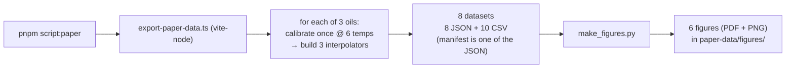

# Results and Exported Paper Data

This document describes `paper-data/`, the machine-generated dataset that backs the paper's figures and results. It covers how the data is produced (a single deterministic export run over three oils and three interpolation strategies), what the manifest records, the eight datasets and their exact columns and row counts, the headline accuracy results (Arrhenius interpolation is effectively exact on this simulator's Arrhenius physics), the six figures and their sources, and the exact commands to reproduce and consume everything. All quantities are in grams (g), seconds (s), and degrees Celsius (°C); flow is in g/s. The numbers here are read directly from the exported files, not restated from memory.

## 1. What `paper-data/` is and how it is generated

`paper-data/` is the full, structured dump of everything the simulator and the calibration model produce, ready to plot. It is written by [export-paper-data.ts](../scripts/export-paper-data.ts), which is run through the vite-node dispatcher [_run.ts](../scripts/_run.ts):

```
pnpm script export-paper-data
```

`pnpm script <name>` expands to `vite-node scripts/_run.ts <name>`; the dispatcher dynamically imports `scripts/export-paper-data.ts`, calls its default `async` function `exportPaperData()`, and awaits it. The function has no `return`; writing files is its effect.

The export runs the same control-library code the app uses ([Control library](./control-library.md)) against the physics-backed simulation ([Simulation](./simulation.md)). Its shape is deliberate:

- **Calibrate once per oil, reuse the store across interpolators.** For each of the three oils in `OIL_PROFILE_LIST`, the exporter builds a fresh `GreaseMachineSimulation({ physics: oil.physics })`, calibrates it once at the six calibration temperatures (`calibrate(sim, CONFIG.calibrationTemps)`), then builds all three interpolators from that one calibration store. This isolates the *interpolation* variable from *calibration* noise: the three strategies are compared against byte-identical calibration data per oil.
- **Structured JSON plus tidy long-format CSV.** Every dataset is written both as pretty-printed JSON (`JSON.stringify(data, null, 2)` in `paper-data/`) and as one or more long-format CSVs (`paper-data/csv/`). In the CSVs each row is one observation and a leading key column (`oil`, `interpolator`, or `series`) identifies the group, so the files drop straight into matplotlib, pgfplots, or a spreadsheet.
- **Deterministic and byte-stable.** Each simulation runs on the instant `ManualClock`, so `clock.sleep()` advances virtual time with no wall-clock dependence; identical inputs give identical outputs. Every numeric CSV cell is rounded to six decimals (`r6`). The *only* non-deterministic byte in the whole export is `manifest.generatedAt`, an ISO timestamp.

The one-command pipeline that produces both data and figures is:

```
pnpm script:paper
```

which is `vite-node scripts/_run.ts export-paper-data && python3 scripts/figures/make_figures.py` — it regenerates the CSV/JSON and then re-plots the figures from the CSVs (§5).



## 2. The manifest

`manifest.json` is written last so it can list every file. It is a self-describing header for the whole export:

- **`generatedAt`** — ISO timestamp; the only non-deterministic field.
- **`config`** — the `CONFIG` grids that drive the run (all in one place):

 | Grid | Value | Meaning |
 |---|---|---|
 | `calibrationTemps` | `[10, 16, 22, 28, 34, 40]` | temperatures the machine is calibrated at, both regimes each (°C) |
 | `physicsGridC` | `0..40` step `1` | fine grid for physics ground-truth curves (°C) |
 | `interpolationGridC` | `10..40` step `1` | fine grid for interpolated curves, inside the calibrated band (°C) |
 | `accuracyTempsC` | `[18, 25, 31]` | intermediate (between-calibration) temperatures for accuracy (°C) |
 | `accuracyTargetsG` | `[2, 5, 10, 30]` | pulse masses for accuracy (g) |
 | `pulseTempsC` | `10..40` step `5` = `[10,15,20,25,30,35,40]` | operational grid for the pulse-run table (°C) |
 | `pulseTargetsG` | `[2, 5, 10, 30]` | pulse masses for the pulse-run table (g) |
 | `shortRefPulseS` | `10` | short pulse duration the drip curves are sampled at (s) |
 | `longRefPulseS` | `150` | long pulse duration (s) |
 | `compare` | `{ massTargetG: 10, fixedCalibrationTempC: 25 }` | compensated-vs-fixed settings (g / °C) |

- **`constants`** — the calibration constants from [consts.ts](../src/lib/grease-machine/consts.ts): `TARGET_SHORT_G = 5`, `TARGET_LONG_G = 30`, `STABLE_TOLERANCE_G = 0.1`, `STABLE_WINDOW_S = 15`, `STABILIZATION_TIMEOUT_S = 120`, `POLL_S = 0.001`.
- **`interpolators`** — `INTERPOLATOR_LIST` as `{ key, label, description, recommended }`, in declared order `arrhenius`, `geometric`, `linear`; arrhenius is `recommended: true`.
- **`oils`** — `OIL_PROFILE_LIST` as `{ id, grade, name, sourced }`: `iso-vg-32` (`sourced: true`, the reference), `iso-vg-22` (derived), `iso-vg-10` (derived).
- **`files`** — the accumulated list of every JSON and CSV written, with row counts for CSVs.

## 3. The eight datasets

The export writes eight datasets: eight JSON files in `paper-data/` (`oils`, `physics-curves`, `calibration`, `interpolation`, `accuracy`, `pulse-runs`, `compare`, `manifest`) and ten CSV files in `paper-data/csv/`. Row counts below are the exact CSV lengths (data rows, excluding the header).

| # | Dataset | JSON | CSV file(s) (rows) | Columns | What it represents |
|---|---|---|---|---|---|
| 1 | Oils and viscosity | `oils.json` | `oils.csv` (3), `viscosity.csv` (15) | `oils.csv`: `oil, grade, name, sourced, density, baseFlow, referenceTemp, flowCoeff, baseDripLimit, dripCoeff, baseTauLoad, baseSettle`. `viscosity.csv`: `oil, temperature, kinematic` | The three oil profiles: descriptive fields plus the seven physics coefficients (one row/oil), and the measured kinematic-viscosity points (cSt vs °C) that justify the coefficients. `sourced` is emitted as `1`/`0`. |
| 2 | Physics ground-truth curves | `physics-curves.json` | `physics-curves.csv` (123) | `oil, temperature, flow, dripLimit, tauLoad, settlingDuration, dripShort, dripLong` | The simulator's source of truth sampled on `0..40 °C` for all three oils (41 × 3 = 123 rows): steady `flow(T)`, `dripLimit(T)`, `tauLoad(T)`, `dripSettlingDuration(T)`, plus drip at the 10 s and 150 s reference pulses. This is the truth the interpolators are measured against. |
| 3 | Calibration points and fitted models | `calibration.json` | `calibration-points.csv` (36), `calibration-models.csv` (18) | points: `oil, temperature, regime, calTarget, motorOnTime, flow, drip`. models: `oil, temperature, flow, dripLimit, tauLoad` | The raw stored `Calibration.Point`s (2 regimes × 6 temps × 3 oils = 36 rows), with `flow` recomputed as `calTarget / motorOnTime`, and the fitted per-temperature `TemperatureModel`s (6 × 3 = 18 rows) — `flow` (g/s), `dripLimit = L` (g), `tauLoad = τ` (s) recovered by the two-anchor loading fit. |
| 4 | Interpolated curves (per strategy) | `interpolation.json` | `interpolation-curves.csv` (279) | `oil, interpolator, temperature, flow, dripShort, dripLong` | Each interpolator's `flowRate(T)`, `drip(T, 10 s)`, `drip(T, 150 s)` sampled on `10..40 °C` (31 temps × 3 interpolators × 3 oils = 279 rows). Plotting these against dataset 2 shows the per-strategy interpolation bias. |
| 5 | Interpolation accuracy at intermediate temps | `accuracy.json` | `accuracy.csv` (108) | `oil, interpolator, temperature, target, motorOnTime, estimatedDrip, delivered, errorAbs, errorPct` | The headline residual: at `[18, 25, 31] °C` (between calibration points) each interpolator dispenses `[2, 5, 10, 30] g`, and delivered mass is scored against the physics ground truth (3 temps × 4 targets × 3 interpolators × 3 oils = 108 rows). JSON also carries per-(oil, interpolator, temp) `meanAbsErrorPct`. |
| 6 | Device pulse runs (operational grid) | `pulse-runs.json` | `pulse-runs.csv` (252) | `oil, interpolator, temperature, target, motorOnTime, estimatedDrip, delivered, miss, errorPct` | The operational dispense table over `10..40 °C` step 5 × `[2, 5, 10, 30] g` × 3 interpolators × 3 oils = 252 rows. `miss` is the signed absolute error in grams (`errorAbs` renamed); a failed solve records an `error` string with null numerics. |
| 7 | Compensated vs fixed-time | `compare.json` | `compare-sweep.csv` (588), `compare-summary.csv` (9) | sweep: `oil, series, temperature, delivered, errorPct`. summary: `oil, interpolator, meanAbsErrorPct, best` | From `runCompareScenario(10 g, 25 °C, …)` per oil. The sweep puts the legacy fixed-time dispenser (`series = "fixed"`) and every interpolator (`series = "geometric"` / `"arrhenius"` / `"linear"`) on one temperature axis for a 10 g dose. The summary is the mean absolute error over the calibrated sweep, `best = 1` for the winning strategy. |
| 8 | Manifest | `manifest.json` | — | see §2 | The run's config grids, constants, interpolator/oil registries, and the file listing. |

## 4. Headline results

### Interpolation accuracy — Arrhenius is effectively exact

The single most important result is the interpolator comparison: how far each temperature-interpolation strategy drifts off-target when dispensing *between* the calibration points, averaged over the calibrated sweep. From `compare-summary.csv` (mean absolute error, percent):

| Oil | arrhenius | geometric | linear | best |
|---|---|---|---|---|
| iso-vg-32 (reference) | 0.000545 % | 0.0916 % | 0.6682 % | arrhenius |
| iso-vg-22 (derived) | 0.001015 % | 0.0805 % | 0.4702 % | arrhenius |
| iso-vg-10 (derived) | 0.001591 % | 0.0696 % | 0.3260 % | arrhenius |

Arrhenius interpolation is best for all three oils, by roughly two orders of magnitude: about **0.0005 %–0.0016 %** mean absolute error (effectively exact), versus **~0.07 %–0.09 %** for geometric and **~0.33 %–0.67 %** for linear.

### Why Arrhenius wins here — and the caveat

All three strategies share the exact same fitted per-temperature model (flow plus an exponential drip curve) and the exact same fixed-point pulse solver; they differ *only* in how they interpolate a model quantity between calibrated temperatures ([Control library](./control-library.md)). So the comparison is apples-to-apples and isolates the interpolation choice.

This simulator's ground-truth physics follows the Arrhenius–Andrade law: `flow`, `dripLimit`, and `tauLoad` are each `base · exp(coeff · T_refK² · (1/T_refK − 1/T_K))` — exp of a linear function of *inverse absolute* temperature (`1/T` in kelvin), the way real oil viscosity behaves ([Simulation](./simulation.md)). The Arrhenius strategy interpolates the *logarithm* of each quantity linearly against `1/(T + 273.15)` and then exponentiates. Because `ln(value)` is exactly linear in `1/T` for this ground truth, `log` linearizes the curve exactly, linear interpolation is exact on a line, and `exp` inverts it — so the Arrhenius strategy reproduces the ground truth with only floating-point plus calibration-discretization residual. The geometric strategy interpolates `log(value)` against *Celsius* instead of `1/T`; since the true exponent is linear in `1/T`, not in °C, it carries a small systematic between-point bias (the ~0.07 %–0.09 % above). Linear interpolation draws a straight chord across a convex curve and is looser still (~0.33 %–0.67 %).

The important caveat: this ranking tracks the physics of the data. Because the simulation now models the physically-realistic Arrhenius law, the Arrhenius strategy is the exact one and is the recommended default. If the ground truth were instead a pure exponential in Celsius, geometric would be the exact one and the ranking would flip. "Best" is data-dependent; Arrhenius is recommended precisely because it matches the canonical viscosity–temperature law real oils obey.

### Compensated vs fixed-time

The compare dataset (dataset 7) contrasts the compensated controller against a legacy fixed-time dispenser calibrated once at 25 °C and asked to deliver a 10 g dose across temperature. As temperature moves away from 25 °C, the fixed-time dispenser drifts steadily off-target — flow rises with temperature and drip falls, so a fixed motor time over-delivers when warm and under-delivers when cold. The compensated controller reads the live temperature, re-solves the pulse equation for the interpolated model, and holds the 10 g dose across the whole sweep. `compare-sweep.csv` places both on one axis so the drift and the hold are directly comparable.

## 5. The figures

`make_figures.py` reads the tidy CSVs and re-plots the app's charts, styled by `style.py` (one source of truth for per-oil / per-interpolator / per-series colours, fonts, grid, and layout — the fixed-time dispenser is the muted amber baseline). Each figure is written to `paper-data/figures/` as both vector PDF (for LaTeX) and PNG.

| Figure (PDF + PNG) | App chart it mirrors | Source CSV(s) |
|---|---|---|
| `viscosity` | Oils / viscosity panel | `viscosity.csv` |
| `curves` | Interpolated curves (geometric) | `interpolation-curves.csv` (geometric rows) |
| `calibration_fit` | Calibration fit | `calibration-points.csv`, `interpolation-curves.csv` |
| `accuracy` | Accuracy panel (at 25 °C) | `accuracy.csv` |
| `compare_delivered` | Compensated-vs-fixed, delivered mass | `compare-sweep.csv` |
| `compare_error` | Compensated-vs-fixed, error | `compare-sweep.csv` |

Regenerate the figures alone (after the data exists) with:

```
python3 scripts/figures/make_figures.py
```

Python dependencies are in `scripts/figures/requirements.txt`; the shared plot styling lives in `scripts/figures/style.py`, and `scripts/figures/README.md` documents the figure set.

## 6. Reproducing and consuming

Regenerate data and figures in one command (from the repo root):

```
pnpm script:paper
```

Or run the two steps separately:

```
pnpm script export-paper-data # writes paper-data/ + paper-data/csv/
python3 scripts/figures/make_figures.py # writes paper-data/figures/
```

Notes:

- **Run from the repo root.** The exporter resolves its output directory from `process.cwd()` (`paper-data/` and `paper-data/csv/`), so the working directory fixes where files land.
- **Determinism.** Every simulation runs on the instant `ManualClock`, so the output is byte-stable across runs and platforms except for `manifest.generatedAt`. Re-running should produce a clean diff.
- **CSVs are tidy long format.** One row per observation, with a leading `oil` / `interpolator` / `series` key column, so the files load directly into matplotlib, pgfplots, or Excel with no reshaping. The JSON files carry the same data nested, plus a few fields not in the flat CSVs (for example per-group `meanAbsErrorPct` in `accuracy.json` and the full `CompareScenarioResult` in `compare.json`).

## See also

- [System overview](../README.md) — index and orientation.
- [Architecture](./architecture.md) — the layered one-way architecture and the detachable control library.
- [Control library](./control-library.md) — the calibration model, interpolators, and pulse solver these datasets exercise.
- [Simulation](./simulation.md) — the physics ground truth and the test harness that generates this data.
