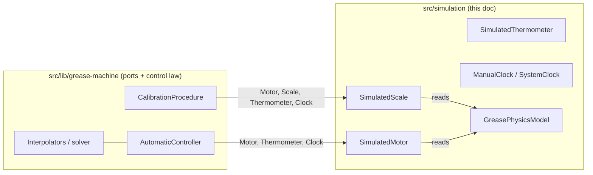

# Physics Simulation and Test Harness

This document describes `src/simulation` — the deterministic stand-in for real hardware that lets the control library be exercised without a physical machine and that generates the paper's datasets. The simulation implements the three hardware ports and the clock port defined by the library, drives them from an analytic physics ground truth, wires everything together in a composition root, and exposes three scenarios that back the app's chart tabs and the data export. Units are grams (g), seconds (s), and degrees Celsius (°C) throughout; flow is in g/s.

## 1. Purpose and role

The control library ([architecture.md](./architecture.md)) is framework-free and hardware-free: it depends only on the `Hardware.Motor`, `Hardware.Scale`, `Hardware.Thermometer`, and `Clock` interfaces. The simulation supplies concrete implementations of those ports backed by an analytic model of a thin drip oil, so the exact same controller, calibration procedure, and interpolator code that will one day drive a real motor and scale runs unchanged against the simulation today.

Three properties make the simulation useful:

- **Ground truth is analytic and hidden.** `GreasePhysicsModel` is the "real world" the calibration procedure samples through the scale port; the controller never sees it ([physics.ts](../src/simulation/physics.ts)). Calibration observes the physics only indirectly, by weighing pulses.
- **Time is virtual and instant.** Scenarios and the exporter run on `ManualClock`, whose `sleep` advances a counter rather than waiting, so a calibration that "waits" 15 s settles in microseconds and identical inputs produce byte-identical outputs.
- **The library is unaware it is simulated.** `GreaseMachineSimulation` is the composition root that assembles the ports; the library imports nothing from `src/simulation`.



## 2. The physics ground truth — `GreasePhysicsModel`

[physics.ts](../src/simulation/physics.ts) models a thin, low-viscosity drip oil. Every gram the simulated scale reports is generated by this model. Flow rises with temperature; the steady long-pulse drip falls with temperature; and drip loads up over the pulse duration toward that steady limit.

### 2.1 Configuration parameters

`PhysicsConfig` ([physics.ts](../src/simulation/physics.ts)) is a seven-field coefficient set. `DEFAULT_PHYSICS` ([physics.ts](../src/simulation/physics.ts)) holds the sourced ISO VG 32 values.

| Field | Meaning | Unit | Default |
|---|---|---|---|
| `baseFlow` | steady mass flow at the reference temperature | g/s | `0.2` |
| `referenceTemp` | reference temperature (the origin of ΔT) | °C | `20` |
| `flowCoeff` | flow log-sensitivity at `referenceTemp` (local, per °C) | 1/°C | `0.053` |
| `baseDripLimit` | steady (long-pulse) drip at the reference temperature | g | `0.6` |
| `dripCoeff` | drip log-sensitivity at `referenceTemp` (local, per °C) | 1/°C | `0.045` |
| `baseTauLoad` | drip loading time constant at the reference temperature | s | `10` |
| `baseSettle` | drip settling duration at the reference temperature | s | `40` |

The defaults are physically grounded ([physics.ts](../src/simulation/physics.ts)) for ISO VG 32 light machine/chain oil in 3 mm ID × 40 cm tubing:

- `flowCoeff = 0.053` /°C: flow `∝ 1/viscosity` (Hagen–Poiseuille); ISO VG 32 viscosity drops about 5.3 %/°C near 20 °C per the ISO 3448 viscosity-temperature table.
- `baseDripLimit = 0.6` g: residual film plus drainable volume (Bretherton / Landau–Levich) for that geometry.
- `dripCoeff = 0.045` /°C: mid-point of the film (`μ^(2/3)`) and drain-time (`μ^1`) temperature dependences.
- `baseTauLoad = 10` s: tube fill time `≈ volume / flow`.
- `baseSettle = 40` s: gravity drain time `8·μ·L/(ρ·g·R²)` (about 12 s) plus the falling-rate drip tail.

The constructor merges caller overrides onto the defaults — `this.config = {...DEFAULT_PHYSICS,...config }` ([physics.ts](../src/simulation/physics.ts)) — so `new GreasePhysicsModel()` yields the VG 32 model, and each oil profile (§3) passes its own `physics`.

### 2.2 The Arrhenius factor and the five methods

Temperature dependence follows the Arrhenius–Andrade law — exponential in *inverse absolute* temperature (`1/T` in kelvin), not in Celsius. A private helper carries all of it ([physics.ts](../src/simulation/physics.ts)). For a quantity with signed local log-sensitivity `coeff` (per °C) it returns a factor normalized to `1` at the reference temperature (`KELVIN = 273.15`):

```
arrhenius(coeff, T) = exp(coeff · T_refK² · (1/T_refK − 1/T_K)) [T_K = T + 273.15]
```

Two properties make this a drop-in for the older `exp(coeff·ΔT)` Celsius form while being physically correct:

- **Reference-anchored.** At `T = referenceTemp` the exponent is `0`, so the factor is `1` and each quantity equals its `baseX` exactly (e.g. `flowRate(20) = baseFlow = 0.2` g/s).
- **Slope-matched at the reference.** `d(ln Q)/dT = coeff` at `referenceTemp`, so the sourced local sensitivity (VG 32: ~5.3 %/°C near 20 °C) is preserved. Away from the reference the sensitivity scales as `(T_refK / T_K)²` — it grows as the oil cools, exactly as real viscosity does. That `1/T` curvature is what makes the Arrhenius interpolator the *exact* fit for this ground truth (§2.3).

The five methods, each taking `temperature` in °C:

**`flowRate(temperature)` → g/s** ([physics.ts](../src/simulation/physics.ts)):

```
flowRate(T) = baseFlow · arrhenius(+flowCoeff, T)
```

The steady mass flow while the motor runs. `flowCoeff > 0`, so flow rises monotonically with temperature; at `T = referenceTemp` it equals `baseFlow`. For VG 32 it runs 0.2 g/s at 20 °C up to 0.539 g/s at 40 °C.

**`dripLimit(temperature)` → g** ([physics.ts](../src/simulation/physics.ts)):

```
dripLimit(T) = baseDripLimit · arrhenius(−dripCoeff, T)
```

The steady drip a very long pulse asymptotically leaves behind. The sensitivity is negated, so the drip limit falls monotonically with temperature (VG 32: 0.6 g at 20 °C, 0.258 g at 40 °C).

**`tauLoad(temperature)` → s** ([physics.ts](../src/simulation/physics.ts)):

```
tauLoad(T) = baseTauLoad · arrhenius(−flowCoeff, T)
```

The drip loading time constant. It reuses `flowCoeff` — not a dedicated coefficient — negated, because `τ` is the inverse-flow timescale (tube fill time `≈ volume/flow`): as flow rises with temperature, `τ` shrinks (VG 32: 10 s at 20 °C, 3.71 s at 40 °C). Colder, more viscous oil charges its residual drip more slowly.

**`drip(temperature, pulseDuration)` → g** ([physics.ts](../src/simulation/physics.ts)): the total residual drip left after a pulse of `pulseDuration` seconds.

```
if (pulseDuration <= 0) return 0;
limit = dripLimit(temperature);
tau = tauLoad(temperature);
return limit * (1 - Math.exp(-pulseDuration / tau));
```

A saturating exponential loading curve *in the pulse duration*: `0` at `t = 0`, approaching `dripLimit(T)` as `t → ∞`. It is **concave** (diminishing returns), which is precisely why calibration recovers `L` and `τ` rather than chord-interpolating between two drip anchors — see [control-library.md](./control-library.md). Only the *temperature* dependence of `L` and `τ` is Arrhenius; the shape in `t` is unchanged.

**`dripSettlingDuration(temperature)` → s** ([physics.ts](../src/simulation/physics.ts)): the wall-clock seconds for the residual drip to fully accrue into the container after the motor stops.

```
dripSettlingDuration(T) = baseSettle · arrhenius(−dripCoeff, T)
```

It uses `dripCoeff` (drip drains faster when warm) and falls monotonically with temperature (VG 32: 40 s at 20 °C, 17.2 s at 40 °C). This term governs only the timing of drip accrual, not its magnitude (§4.2).

### 2.3 Why warmer oil flows faster and drips less

The observables the scale and calibration see are **flow** (g/s while running) and **drip** (residual g after a pulse). Their temperature dependence is entirely the Arrhenius factors above:

- **Warmer means faster flow.** `flowRate` carries `arrhenius(+flowCoeff, T)`. Warming lowers viscosity, and flow `∝ 1/μ` (Hagen–Poiseuille), so flow rises. Near the reference the local sensitivity is `flowCoeff` (VG 32: ~+5.3 %/°C at 20 °C); because the curve is Arrhenius, that sensitivity is stronger when cold and gentler when hot.
- **Warmer means less drip, forming and settling faster.** `dripLimit` carries `arrhenius(−dripCoeff, T)`: warmer oil leaves a thinner residual film and smaller drainable volume, so the steady drip is smaller (VG 32: ~−4.5 %/°C near 20 °C). Separately, `tauLoad` carries `arrhenius(−flowCoeff, T)` and `dripSettlingDuration` carries `arrhenius(−dripCoeff, T)`, so warmer oil charges its drip faster and drains it faster. Those two shorten the timescales without changing the asymptotic drip amount.

Net: at a fixed pulse duration, warmer oil delivers more mass during the run and a smaller drip afterward; colder oil delivers less during the run and a larger, slower-forming, slower-settling drip. Compensating for exactly this temperature sensitivity is the machine's whole purpose.

Because every quantity is exp of a linear function of `1/T` (kelvin), `ln(quantity)` is exactly linear in `1/T` — so the **Arrhenius interpolator (log versus 1/T) is *exact* for this simulator's physics**, and it is the recommended default. The geometric (log versus Celsius) strategy is a close approximation that carries a small residual, and linear is looser still. The ranking of interpolators tracks the physics of the underlying data — see [control-library.md](./control-library.md) and [results.md](./results.md).

## 3. The oils — `OilProfile`

[oils.ts](../src/simulation/oils.ts) defines the fluids the simulation can run. `OilProfile` ([oils.ts](../src/simulation/oils.ts)) carries descriptive fields (`id`, `name`, `grade`, `description`, `density`, `viscosity`, `sourced`, `source`) plus the `physics: PhysicsConfig` that actually drives the simulation. Switching profile means switching the machine's fluid, which forces a recalibration ([oils.ts](../src/simulation/oils.ts)).

`density` (g/cm³ at 15 °C) and the `viscosity` points (cSt vs °C) are **display and provenance only** — none of the five physics methods reads them. The viscosity points are the *justification* for the scaled coefficients (§3.2), not runtime inputs.

The registry `OIL_PROFILES` ([oils.ts](../src/simulation/oils.ts)) holds three profiles; `DEFAULT_OIL_PROFILE_ID = "iso-vg-32"` ([oils.ts](../src/simulation/oils.ts)); `OIL_PROFILE_LIST = Object.values(OIL_PROFILES)` ([oils.ts](../src/simulation/oils.ts)) is the array the exporter iterates.

### 3.1 The three profiles (parameter table)

| Profile | `sourced` | density (g/cm³) | baseFlow (g/s) | referenceTemp (°C) | flowCoeff (1/°C) | baseDripLimit (g) | dripCoeff (1/°C) | baseTauLoad (s) | baseSettle (s) |
|---|---|---|---|---|---|---|---|---|---|
| `iso-vg-32` | true | 0.87 | 0.2 | 20 | 0.053 | 0.6 | 0.045 | 10 | 40 |
| `iso-vg-22` | false | 0.862 | 0.3 | 20 | 0.045 | 0.46 | 0.038 | 7 | 27 |
| `iso-vg-10` | false | 0.858 | 0.76 | 20 | 0.038 | 0.25 | 0.032 | 3 | 11 |

- **`iso-vg-32`** ([oils.ts](../src/simulation/oils.ts)): the reference profile and the **only sourced one** (`sourced: true`). Its `physics` is `DEFAULT_PHYSICS` (§2.1). Source string: "ISO 3448 viscosity-temperature table; Hagen-Poiseuille / Bretherton-Landau-Levich / gravity-drainage derivations."
- **`iso-vg-22`** ([oils.ts](../src/simulation/oils.ts)): illustrative (`sourced: false`), thinner than VG 32 and modelled with a higher viscosity index — flatter viscosity curve, faster flow, less drip. `physics` at [oils.ts](../src/simulation/oils.ts).
- **`iso-vg-10`** ([oils.ts](../src/simulation/oils.ts)): illustrative (`sourced: false`), the thinnest, with the flattest curve and the fastest, shortest-drip behaviour. `physics` at [oils.ts](../src/simulation/oils.ts).

### 3.2 Viscosity data (cSt vs °C)

The measured kinematic-viscosity points ([oils.ts](../src/simulation/oils.ts)). These are `OilViscosityPoint` values ([oils.ts](../src/simulation/oils.ts)) used for display and to justify the coefficient scaling.

| Temperature (°C) | VG 32 (cSt) | VG 22 (cSt) | VG 10 (cSt) |
|---|---|---|---|
| 0 | 277.7 | 133 | 46 |
| 10 | 142.3 | 85 | 31 |
| 20 | 80.3 | 54 | 21 |
| 30 | 49.1 | 35 | 15 |
| 40 | 32.0 | 22 | 10 |

### 3.3 How VG 22 and VG 10 are scaled from VG 32

The two illustrative profiles are not independently sourced; their `physics` is derived from the VG 32 reference by scaling on the reference-temperature (20 °C) kinematic viscosity — VG 32: 80.3 cSt, VG 22: 54 cSt, VG 10: 21 cSt. The scaling relations follow the physical derivations in the physics header ([physics.ts](../src/simulation/physics.ts)) and the profile source strings ([oils.ts](../src/simulation/oils.ts)):

| Coefficient | Scaling law | VG 32 → VG 22 → VG 10 | Check |
|---|---|---|---|
| `baseFlow` | `∝ 1/viscosity` (Hagen–Poiseuille: thinner flows faster) | 0.2 → 0.3 → 0.76 | `0.2·(80.3/54) ≈ 0.30`; `0.2·(80.3/21) ≈ 0.76` |
| `baseTauLoad` | `∝ viscosity` (fill/drain time = volume/flow) | 10 → 7 → 3 | thinner charges faster, so `τ` shrinks |
| `baseDripLimit` | `∝ viscosity^(2/3)` (Landau–Levich film thickness) | 0.6 → 0.46 → 0.25 | `0.6·(54/80.3)^(2/3) ≈ 0.46`; `0.6·(21/80.3)^(2/3) ≈ 0.25` |
| `baseSettle` | `∝ viscosity` (gravity drain `8μL/(ρgR²) ∝ μ`) | 40 → 27 → 11 | `40·(54/80.3) ≈ 27`; `40·(21/80.3) ≈ 11` |

The Arrhenius exponents also decrease for thinner oils — `flowCoeff` 0.053 → 0.045 → 0.038 and `dripCoeff` 0.045 → 0.038 → 0.032. This encodes the higher-viscosity-index narrative ([oils.ts](../src/simulation/oils.ts)): thinner illustrative oils are modelled as less temperature-sensitive, so their flow and drip change less per °C. `referenceTemp` stays 20 °C for all three.

## 4. Simulated hardware

The three port implementations live in `src/simulation/hardware`; the barrel ([index.ts](../src/simulation/hardware/index.ts)) re-exports all three. Each reads the physics model and/or the clock rather than holding independent state.

### 4.1 `SimulatedThermometer`

[simulated-thermometer.ts](../src/simulation/hardware/simulated-thermometer.ts) implements `Hardware.Thermometer` as a single settable field:

```ts
class SimulatedThermometer implements Hardware.Thermometer {
    constructor(public temperature = 20) {}    // °C, mutable public field
    readTemperature(): number { return this.temperature }
}
```

The default is 20 °C. The simulation mutates `.temperature` to set or sweep the ambient temperature ([grease-machine-simulation.ts](../src/simulation/grease-machine-simulation.ts)).

### 4.2 `SimulatedMotor`

[simulated-motor.ts](../src/simulation/hardware/simulated-motor.ts) implements `Hardware.Motor` and tracks on-time against the injected `Clock`, plus the history the scale needs. The constructor takes `(clock, thermometer)` and reads the thermometer to initialize `runTemperature` ([simulated-motor.ts](../src/simulation/hardware/simulated-motor.ts)).

State fields:

- `running`, `startedAt` (clock time this run began, or `null`), `accumulated` (total prior on-time, s) — private ([simulated-motor.ts](../src/simulation/hardware/simulated-motor.ts)).
- `lastStopTime: number | null` — clock time of the last stop; `null` until the first run ([simulated-motor.ts](../src/simulation/hardware/simulated-motor.ts)).
- `lastRunDuration = 0` — duration of the most recent completed run, s ([simulated-motor.ts](../src/simulation/hardware/simulated-motor.ts)).
- `runTemperature` — ambient captured at run start, °C ([simulated-motor.ts](../src/simulation/hardware/simulated-motor.ts)).

Methods:

- `start()` ([simulated-motor.ts](../src/simulation/hardware/simulated-motor.ts)): if not already running, sets `running = true`, `startedAt = clock.now()`, and **locks** `runTemperature = thermometer.readTemperature()`. Locking temperature at pulse start means a later temperature-slider change in the live UI cannot rewrite mass that was already delivered ([simulated-motor.ts](../src/simulation/hardware/simulated-motor.ts)).
- `stop()` ([simulated-motor.ts](../src/simulation/hardware/simulated-motor.ts)): if running, computes `runDuration = clock.now() − startedAt`, adds it to `accumulated`, records `lastRunDuration` and `lastStopTime`, and clears running state.
- `isRunning()` ([simulated-motor.ts](../src/simulation/hardware/simulated-motor.ts)).
- `elapsedOnTime()` → s ([simulated-motor.ts](../src/simulation/hardware/simulated-motor.ts)): `accumulated + (running ? clock.now() − startedAt : 0)` — total on-time since the last reset, including the in-progress run.
- `reset()` ([simulated-motor.ts](../src/simulation/hardware/simulated-motor.ts)): forgets all on-time and history, modelling emptying the measured container.

### 4.3 `SimulatedScale`

[simulated-scale.ts](../src/simulation/hardware/simulated-scale.ts) implements `Hardware.Scale` and turns the physics into a time-varying weight. It is constructed with `(motor, physics, clock)` and is **stateless** — everything is derived from the motor's on-time plus the clock, so it reads correctly whether or not it was polled at the exact stop instant ([simulated-scale.ts](../src/simulation/hardware/simulated-scale.ts)).

`readWeight()` → g ([simulated-scale.ts](../src/simulation/hardware/simulated-scale.ts)):

1. `temperature = motor.runTemperature` — the pulse-locked temperature, not the live thermometer, so sliding the temperature after a pulse does not retroactively change already-dispensed mass ([simulated-scale.ts](../src/simulation/hardware/simulated-scale.ts)).
2. `flow = physics.flowRate(temperature)`; `dispensed = motor.elapsedOnTime() * flow` — the mass delivered while running (g = s · g/s) ([simulated-scale.ts](../src/simulation/hardware/simulated-scale.ts)).
3. If the motor is running, or has never stopped (`lastStopTime === null`), return `dispensed` alone — drip only accrues after a stop ([simulated-scale.ts](../src/simulation/hardware/simulated-scale.ts)).
4. Otherwise add drip, ramped in linearly over the settling window ([simulated-scale.ts](../src/simulation/hardware/simulated-scale.ts)):

```
totalDrip = physics.drip(temperature, motor.lastRunDuration)   // g, for the full pulse length
settle    = physics.dripSettlingDuration(temperature)          // s
sinceStop = clock.now() - motor.lastStopTime                   // s
fraction  = settle > 0 ? clamp(sinceStop / settle, 0, 1) : 1   // 0..1
return dispensed + totalDrip * fraction
```

So the delivered-mass model is:

```
mass(t) = onTime · flow(T) + drip(T, runDuration) · min(1, sinceStop / settle(T))
```

The drip magnitude is fixed by the exponential loading curve; the settling term only spreads that fixed magnitude linearly across `settle` seconds of wall time — a timing ramp, not additional physics. The calibration procedure recovers `flow(T)` as `calTarget/motorOnTime` and `drip(T, motorOnTime)` from this scale, because the scale *is* the physics read back through the port (with tiny discretization noise from the calibration poll overshoot). See [control-library.md](./control-library.md).

### 4.4 The clocks and why virtual time gives determinism

[clock.ts](../src/simulation/clock.ts) provides two `Clock` implementations. The live UI needs real (optionally accelerated) time; scenarios, tests, and the export need instant determinism.

**`SystemClock`** ([clock.ts](../src/simulation/clock.ts)) is a real-time clock with a `timeScale` multiplier. Both `now` and `sleep` are scaled by the same factor, so motor on-time and drip settling stay physically consistent while the wall-clock wait is compressed ([clock.ts](../src/simulation/clock.ts)). `now` returns `((performance.now() − origin) / 1000) · scale`; `sleep(seconds)` waits `(max(0, seconds) / scale) · 1000` ms via `setTimeout`. `setTimeScale` re-anchors `origin` so virtual time is continuous when the demo speed changes ([clock.ts](../src/simulation/clock.ts)).

**`ManualClock`** ([clock.ts](../src/simulation/clock.ts)) is the deterministic virtual clock: `sleep` advances virtual time instantly rather than waiting.

```ts
class ManualClock implements Clock {
    private t: number;
    constructor(start = 0) { this.t = start }
    now(): number { return this.t }
    async sleep(seconds: number): Promise<void> { this.t += Math.max(0, seconds) }
}
```

A calibration that "waits" `STABLE_WINDOW_S = 15` s settles in microseconds of real time ([clock.ts](../src/simulation/clock.ts)). This is the linchpin of export determinism: every `clock.now()` reads a pure accumulation of `sleep` amounts, with no wall-clock dependence, so identical inputs yield byte-identical outputs (see [results.md](./results.md)). Because `sleep` is `async`, the procedure's polling `while` loops still yield to the event loop but advance time by fixed `POLL_S` increments.

## 5. The orchestrator — `GreaseMachineSimulation`

[grease-machine-simulation.ts](../src/simulation/grease-machine-simulation.ts) is the composition root: it wires the physics-backed devices, a calibration store, and a clock, and hands out controllers and the calibration procedure built against those same devices. The control library is unaware it is talking to a simulation ([grease-machine-simulation.ts](../src/simulation/grease-machine-simulation.ts)).

`SimulationConfig` ([grease-machine-simulation.ts](../src/simulation/grease-machine-simulation.ts)): `{ physics?: Partial<PhysicsConfig>; ambientTemp?: number; clock?: Clock; interpolatorKey?: Interpolator.Key }`. The clock defaults to an instant `ManualClock`; pass a `SystemClock` for the live UI. The interpolator defaults to arrhenius.

The constructor builds the object graph in dependency order ([grease-machine-simulation.ts](../src/simulation/grease-machine-simulation.ts)):

```
physics       = new GreasePhysicsModel(config.physics)
clock         = config.clock ?? new ManualClock()
interpolator  = config.interpolatorKey ?? DEFAULT_INTERPOLATOR_KEY
thermometer   = new SimulatedThermometer(config.ambientTemp ?? 20)
motor         = new SimulatedMotor(clock, thermometer)
scale         = new SimulatedScale(motor, physics, clock)
devices       = { motor, scale, thermometer }
store         = new CalibrationStore()
```

Methods:

- `setTemperature(T)` — mutates `thermometer.temperature` ([grease-machine-simulation.ts](../src/simulation/grease-machine-simulation.ts)).
- `setInterpolator(key)` ([grease-machine-simulation.ts](../src/simulation/grease-machine-simulation.ts)); `resetContainer()` → `motor.reset()` ([grease-machine-simulation.ts](../src/simulation/grease-machine-simulation.ts)).
- `controller<K>(key)` → `Controller<K>` — `createController(key, { devices, store, clock, interpolatorKey })` ([grease-machine-simulation.ts](../src/simulation/grease-machine-simulation.ts)). The registry factory returns the precise controller type for the key.
- `calibrationProcedure()` — a `CalibrationProcedure` bound to this simulation's devices, store, and clock ([grease-machine-simulation.ts](../src/simulation/grease-machine-simulation.ts)).
- `calibrateAt(temperature)` → `Promise<Calibration.Point[]>` ([grease-machine-simulation.ts](../src/simulation/grease-machine-simulation.ts)): **isolated instant calibration**. It creates a fresh local `ManualClock`, `SimulatedThermometer(temperature)`, `SimulatedMotor`, `SimulatedScale`, and a `CalibrationProcedure` that writes into `this.store`, then loops `PULSE_REGIMES`, calling `motor.reset()` and `procedure.run(regime)` per regime. Running on its own instant clock means a live machine driven by a real-time `SystemClock` still calibrates immediately without disturbing the live motor and scale ([grease-machine-simulation.ts](../src/simulation/grease-machine-simulation.ts)).
- `clearCalibration()` → `store.clear()` ([grease-machine-simulation.ts](../src/simulation/grease-machine-simulation.ts)).
- `snapshot()` → `SimulationSnapshot` ([grease-machine-simulation.ts](../src/simulation/grease-machine-simulation.ts)): `{ temperature, motorRunning, scaleWeight, calibrationPoints, completeTemperatures, ready }`, a renderable UI snapshot.

At runtime the automatic controller reads the temperature, builds a fresh interpolator, solves the motor time, and runs the motor for exactly that time via `clock.sleep()`; the scale is used only during calibration, not operation. See [control-library.md](./control-library.md).

The simulation barrel ([index.ts](../src/simulation/index.ts)) re-exports physics, oils, clock, hardware, the simulation class, and the scenarios.

## 6. Scenarios

`src/simulation/scenarios` holds three scenarios that calibrate a fresh simulation and then compute a specific dataset. They back the app's chart tabs and are reused by the exporter (see [results.md](./results.md)). `ScenarioOptions` ([calibration-scenario.ts](../src/simulation/scenarios/calibration-scenario.ts)) selects the fluid (`physics`) and interpolation strategy (`interpolatorKey`) a scenario runs against. The barrel is [index.ts](../src/simulation/scenarios/index.ts).

### 6.1 Calibration

[calibration-scenario.ts](../src/simulation/scenarios/calibration-scenario.ts) defines the calibration entry point every other scenario and the exporter reuse.

- `DEFAULT_CALIBRATION_TEMPS = [10, 16, 22, 28, 34, 40]` °C ([calibration-scenario.ts](../src/simulation/scenarios/calibration-scenario.ts)). Six points because the real viscosity-temperature curve is steep (about 5 %/°C), so a few extra calibration points keep the linear interpolation tight across the range ([calibration-scenario.ts](../src/simulation/scenarios/calibration-scenario.ts)).
- `SHORT_REF_PULSE = 10` s and `LONG_REF_PULSE = 150` s ([calibration-scenario.ts](../src/simulation/scenarios/calibration-scenario.ts)) — representative pulse durations for the drip curves (roughly a 2 g and a 30 g dose at this flow). These are the durations at which `drip(T, ·)` is sampled for the plotted curves; they are distinct from the calibration target *masses* (`TARGET_SHORT_G = 5`, `TARGET_LONG_G = 30`).
- `calibrate(sim, temperatures)` ([calibration-scenario.ts](../src/simulation/scenarios/calibration-scenario.ts)): for each temperature, `sim.setTemperature(T)`, then for each regime in `PULSE_REGIMES`, `sim.resetContainer` and `await sim.calibrationProcedure.run(regime)`. This is *the* calibration routine; it populates `sim.store` with 2 points per temperature.
- `runCalibrationScenario(temperatures = DEFAULT, options)` ([calibration-scenario.ts](../src/simulation/scenarios/calibration-scenario.ts)): calibrates a fresh simulation, then `buildModels(store)` and `createInterpolator(key, store)`, and samples a 40-step (`steps = 40`) curve of `flow`, `dripShort` (at `SHORT_REF_PULSE`), and `dripLong` (at `LONG_REF_PULSE`) across `[minT, maxT]` (with a `span === 0` guard for a single temperature). It returns `{ temperatures, points: store.toJSON(), models, curve }` — types `CalibrationScenarioResult` and `CalibrationCurvePoint` ([calibration-scenario.ts](../src/simulation/scenarios/calibration-scenario.ts)). The exporter reuses `calibrate` and `DEFAULT_CALIBRATION_TEMPS` directly rather than calling this function.

### 6.2 Accuracy

[accuracy-scenario.ts](../src/simulation/scenarios/accuracy-scenario.ts) measures the residual error of interpolating a non-linear physics *between* calibration points.

`runAccuracyScenario(temperature = 25, targets = DEFAULT_ACCURACY_TARGETS, calibrationTemps = DEFAULT_CALIBRATION_TEMPS, options)` ([accuracy-scenario.ts](../src/simulation/scenarios/accuracy-scenario.ts)), with `DEFAULT_ACCURACY_TARGETS = [2, 5, 10, 30]` g ([accuracy-scenario.ts](../src/simulation/scenarios/accuracy-scenario.ts)): calibrate a fresh simulation, build the interpolator, and for each target mass compute

```
motorOnTime = interp.solveMotorTime({ massTarget, temperature })
delivered = motorOnTime · physics.flowRate(T) + physics.drip(T, motorOnTime)
errorAbs = delivered − massTarget
errorPct = errorAbs / massTarget · 100
```

`delivered` is the physics ground truth for the motor time the controller chose ([accuracy-scenario.ts](../src/simulation/scenarios/accuracy-scenario.ts)). It returns `AccuracyScenarioResult` ([accuracy-scenario.ts](../src/simulation/scenarios/accuracy-scenario.ts)) with one `AccuracyResult` ([accuracy-scenario.ts](../src/simulation/scenarios/accuracy-scenario.ts)) per target. The intermediate temperature (default 25 °C) sits between the calibration points, so the error is purely the interpolation residual.

### 6.3 Compare

[compare-scenario.ts](../src/simulation/scenarios/compare-scenario.ts) contrasts the temperature-compensated controller — run with *every* available interpolation strategy — against a legacy fixed-time dispenser set once at `fixedCalibrationTemp` ([compare-scenario.ts](../src/simulation/scenarios/compare-scenario.ts)). As temperature drifts, the fixed dispenser over- or under-dispenses badly while every interpolator holds near the target; the remaining sub-percent differences between interpolators are what the error chart surfaces, and the lowest-error strategy is flagged as best.

`DEFAULT_COMPARE_TEMPS = [10, 20, 28, 35]` °C ([compare-scenario.ts](../src/simulation/scenarios/compare-scenario.ts)); `SWEEP_STEPS = 48` ([compare-scenario.ts](../src/simulation/scenarios/compare-scenario.ts)).

Helpers:

- `trueMotorTime(physics, T, target)` → s ([compare-scenario.ts](../src/simulation/scenarios/compare-scenario.ts)): the physics-exact motor time for the legacy dispenser, by the same fixed-point iteration the interpolator uses but against the *real* physics — seed `t = target / flow`, then up to 100 iterations of `next = (target − physics.drip(T, t)) / flow`, converging at `|next − t| < 1e-9`.
- `point(physics, T, motorOnTime, massTarget)` → `CompareSeriesPoint` ([compare-scenario.ts](../src/simulation/scenarios/compare-scenario.ts)): `delivered = motorOnTime · flowRate(T) + drip(T, motorOnTime)`; `errorPct = (delivered − massTarget) / massTarget · 100`.
- `sweepRange(min, max, steps)` ([compare-scenario.ts](../src/simulation/scenarios/compare-scenario.ts)): `steps + 1` inclusive evenly-spaced temperatures (a single `[min]` when `max === min`).

`runCompareScenario(massTarget = 5, fixedCalibrationTemp = 25, temps = DEFAULT_COMPARE_TEMPS, calibrationTemps = DEFAULT_CALIBRATION_TEMPS, options)` ([compare-scenario.ts](../src/simulation/scenarios/compare-scenario.ts)):

1. Calibrate a fresh simulation; `sweepTemps = sweepRange(min, max of calibrationTemps, 48)`.
2. Build the **legacy fixed dispenser**: one motor time `fixedTime = trueMotorTime(physics, fixedCalibrationTemp, massTarget)`, evaluated with `point(...)` at the coarse `temps` (`rows`) and the fine `sweepTemps` (`sweep`).
3. For **every** registry entry, `interp = entry.create(store)`, then `at(T) = point(physics, T, interp.solveMotorTime({ massTarget, temperature: T }), massTarget)`; `sweep = sweepTemps.map(at)`; `meanAbsErrorPct = mean(|errorPct|)` over the sweep; `rows = temps.map(at)`.
4. `bestKey` = the strategy with the lowest `meanAbsErrorPct` (`reduce`).

It returns `CompareScenarioResult` ([compare-scenario.ts](../src/simulation/scenarios/compare-scenario.ts)) — `{ massTarget, fixedCalibrationTemp, temps, sweepTemps, fixed: { rows, sweep }, interpolators: CompareInterpolatorSeries[], bestKey }`, with `CompareInterpolatorSeries` ([compare-scenario.ts](../src/simulation/scenarios/compare-scenario.ts)) carrying `key`, coarse `rows`, fine `sweep`, and `meanAbsErrorPct`. The exporter calls this scenario per oil to produce the compensated-vs-fixed dataset (see [results.md](./results.md)).

## See also

- [README.md](./README.md) — index and system overview
- [architecture.md](./architecture.md) — layered one-way architecture and the detachable control library
- [control-library.md](./control-library.md) — the grease-machine control library in depth
- [results.md](./results.md) — the exported paper-data datasets and results
